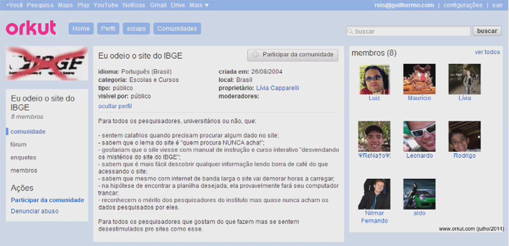
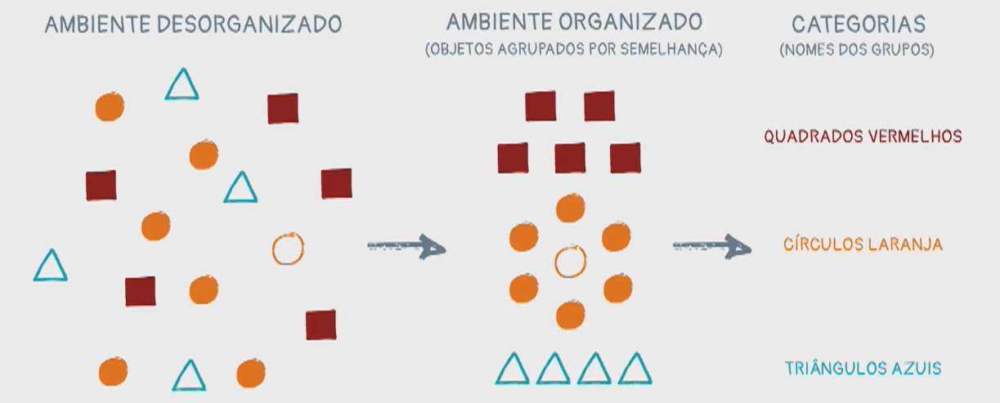
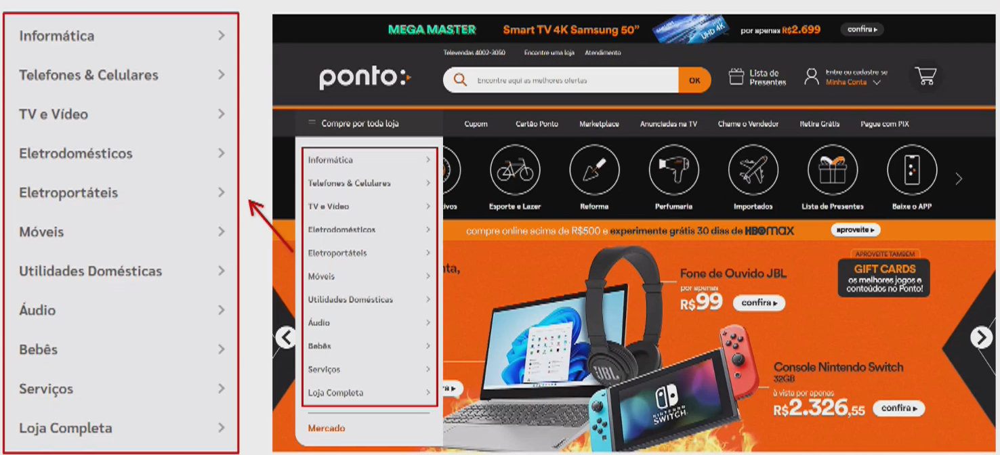
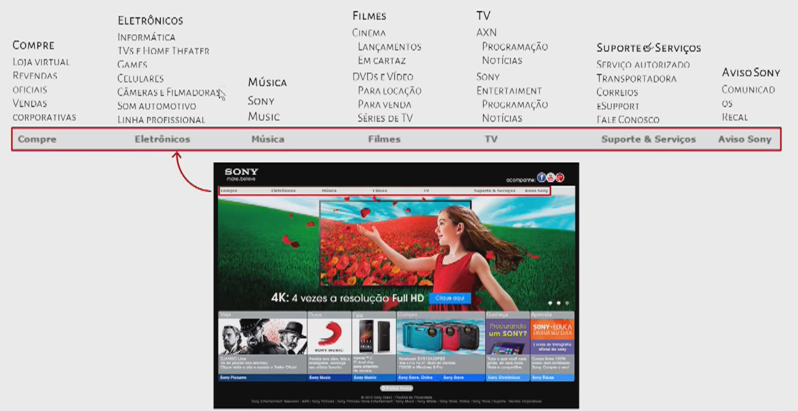
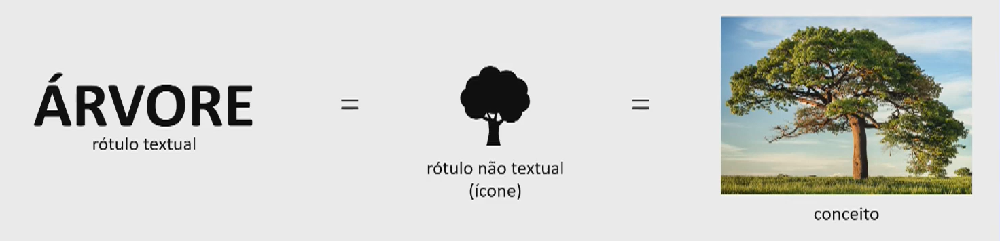

# User Experience (UX) I

[Clique aqui](https://mm.tt/app/map/3052644584?t=CJfZtnGoXl) para acesso o mapa mental!

## :one: Exemplo de utilização do UX 1

Vamos analisar as latas de tomate da imagem abaixo, da esquerda para a direita, e ver como a usabilidade foi utilizada para modificar o design delas ao longo do tempo.

A lata mais à esquerda já é uma evolução se comparada as anteriores, onde era necessário utilizar estacas e martelos para abrí-las por conta de sua rigidez. Na guerra, finalidade para a qual as latas foram criadas, armazenando alimentos que era consumidos pelos combatentes, os mesmos utilizavam-se de suas armas para conseguir abrí-las. Porém, mesmo essa primeira lata, ela ainda não é tão simples de se abrir, pois é necessário uma outra ferramenta, que é o abridor, e seu manuseio não é tão intuitivo e simples.

A fim de facilitar o manuseio do usuário, foi desenvolvido o segundo modelo de lata, onde se era utilizado uma espécie de anel que quando puxado, abria a lata, sendo muito mais simples e sem a necessidade de uma outra ferramenta. Porém, esse modelo ainda possuia falhas, como por exemplo, a necessidade de se moderar essas força imprimida para abrí-la, já que se fosse colocada muita força, o anel poderia acabar soltando e a lata permanecendo fechada, sendo então necessário utilizar um abridor. Outra questão é que a lámina utilizada para fechar a lata é altamente cortante, podendo causar acidentes.

Assim, nasceu o terceiro modelo de lata com tampa, muito mais simples de ser aberto, sem necessidade de outros equipamentos, sem necessidade de imprimir grande força e muito mais seguro.

Nesse exemplo, vemos como analisar a experiência do usuário é importante para a melhoria de um produto.

## :two: Exemplo de utilização do UX 2

Porém UX não utilizado apenas em produtos físicos, podendo também ser utilizado em produtos digitais, como por exemplo, em uma página web. Vamos utilizar o site do clima tempo como exemplo. Na primeira imagem, vemos um print da página inicial do site do Climatempo em fevereiro de 2014, trazendo informações voltadas para diferentes públicos. Porém, se pararmos para pensar, a grande maioria das pessoas que acessam esses sites de climatologia, estão interessados em saber como estará o tempo no lugar onde estão ou estarão, para definir qual tipo de roupa levar e até mesmo se será preciso de guarda chuva ou não, não estando interessadas em dados mais específicos, que fica restrito a um público bem menor. Portanto, podemos identificar um problema de experiência do usuário nessa página, que é o acumulo de informações em uma mesma página que tem pouca importância para o público geral, tornando a página mais confusa de ser manuseada e até pouco atrativa.

Se vemos essa segunda imagem, ela é muito mais simples, traz apenas as informações mais relevantes para a maioria das pessoas, como o clima ao longo do dia no lugar que ela está consultando, probabilidade de chuva, vento, umidade e horário do nascer e por do sol, que é geralmente o que as pessoas procuram. Caso deseje ter acesso a mais informações, é necessário navegar pelo menu da plataforma. Vemos então como a manipulação do site se tornou mais simples e visualmente ele se tornou muito mais agradável, o que também importa.

## :three: O que é User Experience?

*"UX é tudo que o usuário vivencia ao utilizar um produto"* - Don Norman

A imagem abaixo mostra a Colméia do UX, que apresenta palavras relacionadas a conceitos utilizados nesse campo de estudo:

- **Útil** e **Utilizável**: O professor deu o exemplo de um aplicativo de carona desenvolvido em uma empresa, onde os usuários poderiam obter caronas com pessoas que não necessariamente trabalham com aquilo. Era uma forma de facilitar as viagens para os usuários e ao mesmo tempo criar uma forma de renda extra para quem oferecia as caronas. Acontece que nos primeiros meses do projeto, os acessos estavam baixíssimos e logo culparam a UX Designer pelos resultados, alegando que o uso do aplicativo era baixo pois ele não era tão intuitívo de se utilizar. A mesma optou por realizar um **Teste de Usabilidade**, onde se coloca um usuário para utilizar o seu produto e fica analisando as dificuldades que ele encontra. Ao final do teste, ela começou a fazer perguntas para os mesmos para saber se eles encontravam dificuldades no manuseio do aplicativo e todos negaram. Ela então decidiu perguntar se eles o utilizariam e todos negaram alegando receio de pegar carona com alguém que não conhecem, por medo de sofrerem assalto ou sequestro. Com esse exemplo podemos entender as duas primeiras palavras apresentadas na colméia. O aplicativo é **útil**, pois ele traz um ganho para as pessoas oferecendo um serviço a mais de transporte e também traz uma opção de renda extra pra quem necessita, porém, ele nãoé **utilizável**, pois no contexto onde os usuários estão inseridos, os índices de assalto e sequestro são significativos, distanciando-os da possibilidade de se utilizar a aplicação. Após essa pesquisa, uma alternativa encontrada foi limitar o aplicativo a nichos mais específicos, como por exemplo, oferecer caronas apenas entre usuários de uma mesma empresa.
  - Outro exemplo pode ser o caixa eletrônico: ele é **útil** porque é a forma mais simples de sacar dinheiro das contas bancárias, porém, está se tornando cada vez menos **utilizável**, por conta da diminuição do número de agências bancárias físicas, pela onda de bancos digitais e pela facilidade oferecida de se realizar compras através de cartões de crédito/débito e pix.

- **Encontrável**: é fácil encontrar o seu produto? Utilizando como exemplo um aplicativo, ele é fácil de se encontrar através do Google? Ele está disponível nas principais lojas de aplicativos?

- **Confiável**: Qual a confiança que o seu produto transmite? No caso de um banco, o quanto é confiável manter todo o seu dinheiro depositado nele? No caso de aplicativos de aluguel ou reserva de hospedagem, como Airbnb ou Booking.com, o quanto é confiável eu realizar uma reserva, ir até o local de destino e chegar lá e ter a garantia de que a sua reserva estará disponível?

- **Acessível**: o seu produto é acessível para usuários com deficiências físicas, cognitivas e até mesmo educacionais? O seu produto possuí esse tipo de usuário?
  - A W3C disponibiliza um guia de acessibilidade de como realizar a construção de sites e interfaces no geral.

- **Valioso**: O quanto de ganho esse produto traz para seus usuários?

- **Desejável**: O seu produto consegue agregar além do serviço que ele pretende entregar?

## :four: Por que UX é importante?

O IBGE (Instituto Brasileiro de Geografia e Estatística) é uma das principais instituições brasileiras e que recebe todos os anos milhões e mais milhões de reais para investir nas suas pesquisas. Ele é responsável por realizar o senso, onde os funcionários vão de casa em casa e realizam o levantamento de informações que descrevem as características do povo brasileiro e disponibilizam todas elas em seu site. Toda empresa utiliza esses dados coletados pelo IBGE para definir seus projetos estratégicos. Mas de nada vale todo dinheiro investido, ter essa relevância e realizar todos esses estudos para no fim disponibilizá-los de forma tão inacessível e até mesmo mal estruturada.

"*Transparência vai além de disponibilizar as informações, tem haver também como eles são disponibilizados. Eles são acessíveis?*"

Pense em você dono de uma loja: se o seu cliente é mal atendido, tem uma experiência ruim, dificilmente ele irá retornar, e ainda acabará contando da experiência dele para outras pessoas, que podem acabar deixando de frequentá-la por conta desses relatos, deixando a empresa com uma fama ruim. Com aplicativos é igual.

UX também diminui o número de ligações a call center para tirar dúvidas referentes ao produto/plataforma, evita maior custo de redesign, acaba vendendo mais (se seu produto é díficil de utilizar, o cliente vai para um mais fácil), além de ser bom para a imagem do produto.

## :five: O que é Arquitetura de Informação?

*"Tornar o complexo claro"* - Wurman

1. O design estrutural de ambientes de informação compartilhados;
2. A combinação dos esquemas de organização, de rotulação, de busca e de navegação dentro de ecossistemas digitais, físicos e cross-channel;
3. A arte e a ciência de moldar produtos e experiências de informação para suportar a usabilidade, a encontrabilidade (*findability*) e o entendimento;
4. Uma disciplina emergente e uma comunidade de prática focada em trazer princípios do design e da arquitetura para o espaço digital.

"*Nós não projetamos a experiência, pois isso é individual de cada usuário e do momento em que ele se encontra. Porém, projetamos as variáveis que podem influenciar nessa experiência de alguma forma.*"

## :six: Exercício

Na imagem abaixo temos o mapa do metrô de Tóquio. Em cinza temos o mapa da cidade de Tóquio e as linhas pretas representam a malha ferroviária, que circunda a cidade. No meio da cidade passa outra linha e em destaque aparece o Palácio Imperial, um dos monumentos mais importantes do Japão. Se você fosse contratado para desenhar o mapa do metrô de Tóquio que seria disponibilizado para os usuários terem acesso as informações, o que você colocaria nesse mapa?

Na imagem abaixo temos a representação oficial do mapa do metrô de Tóquio. Em verde são exibidas as estações que circundam a cidade, até por isso o uso de um círculo, para dar essa impressão e não a representação real, uma vez que pro usuário pouco importa se o trem vai para a direita ou esquerda e sim para qual caminho ele segue. O nome de cada uma das estações está na parte de dentro do círculo, utilizando algarismos alfanuméricos e não as letras japoneses, uma vez que são de difícil compreensão para estrangeiros, que são muito presentes nas cidades. Do lado de fora do círculo são destacados alguns pontos turísticos que estão perto de cada uma dessas estações.

O UX sempre se utiliza de três entidades para a construção dos seus modelos: Usuário, Conteúdo e Contexto.

Vamos agora utilizar o metrô de São Paulo como exemplo. Quando entramos em uma das estações logo nos deparamos com um tipo de mapa, que mostra o entorno da estação, apresentando as ruas próximas, possíveis pontos de interesse do cidadão, etc. Esse mapa é pensado para as pessoas que estão entrando e saindo das estações e podem estar querendo se localizar geograficamente na cidade. Passando as catracas, ainda fora do vagão, temos outro tipo de mapa, que apresenta a malha ferroviária completa, que pode ser utilizada por usuários que ainda não entraram nos vagões pois precisam entender e decidir para qual sentido eles vão e quais ações eles devem realizar para chegar no seu destino. Uma vez dentro do vagão, o mapa  é muito mais simplificado, sendo apenas a representação da linha que ele se encontra, com uma luz destacando qual a próxima estação de parada e onde é possível realizar a baldeação para outras linhas. Para os usuários dentro do vagão, pouco importa o resto das informações.

Podemos perceber que cada um desses mapas analisa o **contexto** e as necessidades dos **usuários** e seu **conteúdo** é moldado a partir disso.

## :seven: O que é Usabilidade?

Usabilidade é a medida na qual um sistema, produto ou serviço pode ser usado por usuários específicos para alcançar objetivos com eficácia, eficiência e satisfação em um contexto espefícico de uso.

Atributos da Usabilidade:

- **Facilidade de aprendizagem:** Capacidade com que o usuário começa a interagir rapidamente com o sistema logo na primeira vez que o utiliza;
- **Eficiência de uso:** Grau de produtividade atingido pelo usuário depois que aprendeu a utilizar o sistema;
- **Facilidade de memorização:** Retenção, capacidade do usuário voltar a utilizar o sistema após certo tempo sem precisar aprendê-lo novamente;
- **Baixa taxa de erros:** Medida do quanto o usuário pode ser induzido ao erro pelo sistema e o quanto pode ser recuperado do mesmo;
- **Satisfação subjetiva:** Medida do quanto o usuário se sente feliz de estar utilizando o sistema.

Para explicar os tópicos de eficiência de uso e baixa taxa de erros, vamos utilizar o exemplo do Internet Banking.

- Os usuários que utilizam esse serviço primeiramente pensam na segurança do seu dinheiro e se ele está sendo encaminhado para o lugar em um pagamento ou transferência. Por isso que toda vez que uma transação for realizada cada uma das informações é solicitada em uma tela e há sempre confirmação dos dados, para diminuir a possibilidade de usuário inserir informações incorretas;
- O processo de pagar contas através do aplicativo é um meio mais fácil do que ir até a agência fisicamente para realizar o pagamento na boca do caixa ou no caixa eletrônico, mas ainda sim pode ser cansativo dependendo da quantidade de contas que precisamos pagar. Agora pense numa empresa e a quantidade de contas que ela deve pagar, que pode ser 100 vezes maior do que uma pessoa comum. Nesse caso, muitos aplicativos oferecem para contas de pessoa jurídica algumas facilidades como pagar várias contas de uma só vez, trazendo a sensação de eficiência para esse tipo de usuário.

Para falar da facilidade de memorização, vamos pensar no software para declarar imposto de renda, que é utilizado uma vez por ano. Se todo ano a interface mudar, será sempre uma dificuldade quando precisarmos utilizá-lo, por isso sua interface muda muito pouco, a fim de diminuir o estresse do usuário quando precisar utilizá-lo novamente e não precisar ficar reaprendendo como ele funciona.

- A memorização também pode estar relacionada as informações de uma tela para a outra. O usuário não é obrigado a saber o que preencheu há três telas atrás, por isso, é dever do sistema relembrá-lo dessas informações.

## :eight: Sistema de Organização

### :arrow_right: O que é?

O **Sistema de Organização** é responsável por definir as regras de classificação e ordenação dos conteúdos e das funcionalidades do produto. Seu desafio é organizar essas informações de uma maneira que o usuário compreenda a estrutura, ajudando-o a encontrar o que precisa para atingir seus objetivos.

Respondendo a pergunta da imagem acima, e destacando que estamos comparando um dicionário daqueles mais robustos com um caça palavras nível difícil, vai ser mais fácil encontrar as palavras no dicionário, uma vez que suas informações estão organizadas e sabemos como essa organização é feita.

### :arrow_right: Categorização

Categorizar (ou classificar) é agrupar entidades (objetos, ideias, ações, etc.) por semelhança. Cada grupo de entidades semelhantes é uma categoria.

Categorizar é um processo cognitivo natural usado para:

- Compreender o mundo a nossa volta. É muito normal quando somos pequenos dar nomes aos objetos que não necessariamente são os nomes verdadeiros deles, porém, explicam suas características ou para o que eles servem. O professor deu o exemplo da filha dele que chamava o sabonete líquido de shampoo para as mãos e do filho dele que adorava brincar de carrinho e chamava a picápe de carro com furo.

- Reduzir a demanda de memória e o esforço cognitivo para armazenar e recuperar informações. O professor deu o exemplo de quando ele estava em um Happy Hour e conversando com os gringos sobre o Brasil decidiu falar sobre a lenda do Boto Cor de Rosa. Mas como explicar para os gringos o que seria um Boto Cor de Rosa. Para facilitar a explicação, eles descreveram o mesmo como um *Pink Dolphin* (Golfinho Rosa). Apesar de não ser a explicação 100% correta, essa associação facilitou para aqueles que estavam explicando dar a ideia de como é um Boto, assim como facilitou para os gringos rapidamente terem uma noção de como um Boto se parecia.
  - Podemos fazer um paralelo com a Orientação Objeto: quando é feita a associação do Boto Cor de Rosa com o Golfinho, é como se o Boto herdasse todos os atributos e métodos de um Golfinho;
  - A POO tem como um de seus objetivos a construção de Classes que podem ser reaproveitadas por diversos objetos semelhantes, diminuindo a complexidade do código. Podemos compreender esses processos de criação de Classes e herança como processos de Categorização.

### :arrow_right: Dificuldades para Organizar a Informação

#### :arrow_right::arrow_right: Ambiguidade

As línguas portuguesa, inglesa, espanhola, etc. são ambíguas, isto é, uma mesma palavra pode possuir significados diferentes, o que algumas vezes pode dificultar a classificação de entidades e a compreensão do que aquela categoria engloba.

Veja, por exemplo, as seções existentes no menu do site da Ponto Frio:

Caso você acessasse o site da Ponto Frio com o objetivo de buscar um liquidificador, você procuraria inicialmente na seção "Eletrodomésticos" ou em "Eletroportáteis"? Isso pode causar alguma confusão, pois um Liquidificador é um Eletrodoméstico, porém, ele é portátil.

Agora, se quisermos pesquisar sobre um *Home Theater*. Ele estará na categoria "TV e Vídeo" ou "Áudio"? Ele pode estar nas duas, e não há problema de uma mesma entidade estar em duas categorias diferentes desde que ela possua características semelhantes com ambas que justifique a presença em ambas categorias.

#### :arrow_right::arrow_right: Heterogeneidade

Se a nossa marca oferecer diferentes tipos de serviços, pode ser um desafio, por exemplo, organizar todos eles em uma página web. Veja abaixo o exemplo do site da Sony em 2013. A Sony é uma empresa que possui equipamentos eletrônicos, como televisões, video games, computadores, etc., é um selo musical, possui estúdio de filmes e canais de televisão, além de suporte ao cliente. Na imagem abaixo vemos que ela conseguiu categorizar todos eles de forma que ficasse fácil encontrar cada um desses produtos, mas nem sempre é uma tarefa simples.

Hoje o site da Sony apresenta apenas conteúdos relacionados a seus eletrônicos e os seus demais produtos foram redirecionados para outros sites de outras empresas do grupo Sony.

#### :arrow_right::arrow_right: Diferenças de Perspectiva

Devemos tomar cuidado para organizar a informação de acordo com a perspectiva do usuário e não com a nossa. Um exemplo de organização da informação de acordo com uma perspectiva é o sistema utilizado na biblioteconomia para classificação de livros, a Classificação Decimal de Dewey (CDD).

A ideia do CDD pode ser exemplificada através de uma árvore e cada nível dessa árvore pode conter apenas dez ramos e cada ramo pode possuir apenas dez níveis. A cada nível dessa árvore, o nível de granularidade do tema é maior. Por exemplo, no nível 1 organizamos livros entre Ciências Exatas, Humanas e Biológicas. No nível 2, em Exatas, separamos em Matemática e Física, e no nível 3 de física, os livros são separados em Mecânica, Eletromagnetismo e Termodinâmica. Portanto, todo livro de Termodinâmica seu código inicial no sistema da biblioteca será 123. Lembrando que isso é um exemplo e não reflete literalmente a verdade.

Porém, esse sistema possui algumas críticas, por conta da sua visão eurocentrista cristã na classificação dos livros. Quando vemos a classificação de livros de religião, por exemplo, a categoria 1 representa apenas religiões cristãs e as demais religiões ficam na categoria "Outros". O mesmo ocorre na classificação de livros de línguas, onde as línguas representadas no primeiro nível são todas de origem européia e as demais ficam em "Outros". Isso acontece pois no contexto onde Dewey estava inserido, a Europa era o centro do mundo e era dominada pelas religiões cristãs.

A dificuldade em se alterar esse sistema nos dias de hoje é que seria necessário remanejar todas as bibliotecas do mundo.

Pegando um exemplo associado ao mundo digital, na imagem abaixo vemos a página do Microsoft 365, que é um produto voltado para diversos públicos, como acadêmico, empresarial ou até mesmo de uso pessoal. Para melhorar a experiencia de cada um desses grupos, que possuem necessidades diferentes, foram criadas páginas onde a apresentação do produto é feita de acordo com a perspectiva de cada um desses usuários, destacando talvez um serviço do produto que tenha mais relevância para um grupo do que outro, etc.

#### :arrow_right::arrow_right: Políticas Internas

Todas empresa possui suas políticas internas, portanto, nem sempre será possível atender todas as vontades dos usuários. Assim, é necessário um jogo de cintura e criatividade para tentar propor alternativas que buscam satisfazer os usuários, porém, sem infrinjir nenhuma política da companhia.

Um exemplo é o site de uma montadora, como no exemplo da imagem a baixo, a Chevrolet. Em seu site ela irá fornecer diferentes informações relacionadas a seus veículos, como imagens de todos os ângulos, propriedades e características do carro, manuais, etc. Porém, ela não pode fornecer o preço do veículo, uma vez que não é ela que irá determinar o valor de venda e sim as concessionárias. Uma alternativa foi inserir um botão "Solicitar Proposta", que irá contatar uma das concessionárias afiliadas a montadora para informar os preços e possibildades para o cliente.

#### :arrow_right::arrow_right: Estética

A estética é muito importante na construção de um produto e muitas vezes a beleza acaba compensando alguns pequenos erros que um produto pode possuir. Porém, devemos ter em mente que não basta a estética pela estética e sim, que ela acompanhe o funcionamento do produto de forma harmonioza.

Na imagem abaixo vemos o layout de um site de 2005, construído em flash e que chegou a receber diversos prêmios por conta da sua estética diferenciada. As bolinhas que aparecem na página se mexem e o menu da página também era bolinhas, que quando se passava o mouse por cima, sumiam e davam lugar ao nome das seções do menu. Porém, quando se tirava o mouse de cima desse trecho, as bolinhas voltavam. Isso acabou causando uma espécie de jogo da memória, pois caso o usuário não tenha decorado a ordem dos ícones, o que é muito comum, ele precisa sempre primeiro passar o mouse por cima das bolas para elas saírem e aparecerem as palavras, o que apesar de ser esteticamente interessante, é pouco funcional.

### :arrow_right: Esquemas de Organização

São maneiras de criar categorias a partir da semântica (significado) dos conteúdos.

Cada esquema possui uma regra simples para formar categorias.

Facilitam o entendimento sobre como a informação está organizada, trazendo consistência e previsibilidade à interface.

Os tipos de esquemas de organização são separados em duas categorias:

- **Exatos**:

  - Tem categorias bem definidas e mutuamente exclusivas (uma entidade não pode estar em duas categorias ao mesmo tempo);
  - Tem regras claras para inclusão de novos itens;
  - São indicados quando o usuário sabe exatamente o que está procurando.

- **Ambíguos**:

  - Dividem a informação em categorias subjetivas, que podem ser afetadas por ambiguidades linguísticas, culturais, cognitivas e comportamentais;
  - Não tem regras claras para incluir novos itens;
  - São indicados quando o usuário não sabe exatamente o que está procurando e quer sugestões.

#### :arrow_right::arrow_right: Esquemas Exatos

Desejamos ir ao cinema no dia de hoje na parte da noite e queremos pesquisar quais filmes estão passando e seus horários. Para isso utilizamos o Guia da Folha para cinemas. Porém, não vamos em qualquer cinema, desejamos saber as seções existentes em locais próximos de onde estamos. A pergunta que fica é: qual das categorias abaixo selecionariamos para obter a informação que desejamos?

A resposta seria: "Salas" para vermos por cinema ou "Bairro" para vermos por bairro. Nesse caso foi utilizado um esquema exato pois o usuário nesse contexto sabe exatamente o que desejam, que é pesquisar os filmes existentes nos cinemas por localidade.

Esquemas exatos existentes:

- **Alfabeto:** Para grandes conjuntos de informação e público muito diversificado;

  

  - O esquema de Alfabeto é arbitrário, ou seja, ele segue uma regra pré-definida;
  - Esse modelo é interessante quando desejamos fugir de questões políticas;
  - Exemplo: Como definir a ordem que os países vão desfilar na abertura da Olímpiada? Se utilizassem uma ordem aleatória, pode ser gerada alguma interpretação equivocada de cunho racial, étnico, etc. Por isso os países desfilam em ordem alfabética, para evitar qualquer problema;
  - Deve se levar em consideração de contexto: quando estamos falando de artistas musicais, a ordem deve ser estabelecida a partir do primeiro nome. No caso de autores de livros, a ordem deve ser estabelecida a partir do sobrenome do autor.

- **Tempo:** Conta uma história ou mostra eventos em ordem cronológica direta ou reversa;
  - No exemplo abaixo a ordem cronológica é do mais antigo para o mais novo pois desejamos contar uma história:

    
  
  - No exemplo abaixo a ordem cronológica é do mais novo para o mais antigo pois o portal deseja manter os usuários o mais atualizados sobre as notícias do momento:

    

  - No exemplo abaixo temos um exemplo de organização baseada no tempo para gestantes, uma vez que a cada idade da criança as informações, os cuidados e preocupações são diferentes:

    

- **Localização:** Compara informações de locais diferentes;
  - Nesse primeiro exemplo, apresentamos a interface de uma plataforma para aluguel de apartamentos. Geralmente as pessoas quando vão alugar um apartamento, levam em consideração algumas questões como segurança, proximidade com os locais de interesse dela, etc., fazendo-se útil a organização dos produtos que a plataforma oferece por localização.

    

  - É muito comum também a utilização de mapas para exibir informações relacionadas a clima e eleições. Quando falamos de eleições devemos tomar um cuidado que é a densidade populacional, que deve ser levada em consideração, pois as vezes algumas localidades são maiores do que outras, por exemplo, o estado do Amazonas é maior que o do Rio de Janeiro, só que a população do Rio é muito maior, sendo mais relevante para eleições a nível presidencial, por exemplo, sendo necessário tomar esse cuidado para não gerar uma falsa impressão.

    

  - A Tok&Stok, empresa especializada em móveis e decoração para casas, separa seus produtos de acordo com a localização usual deles nas casas, como objetos para salas, quartos, banheiros, etc.

    

- **Sequência:** Organiza itens por ordem de grandeza. Confere valor ou peso à informação.
  - O Zoom é uma plataforma que realiza a comparação de preços em diferentes e-commerces. Os seus usuários geralmente o utilizam para procurar em qual loja o produto que eles desejam está sendo vendido mais barato, portanto, faz sentido ele permitir organizar esses produtos do com menor preço para o maior, por exemplo.

    

#### :arrow_right::arrow_right: Esquemas Ambíguos

Voltando no exemplo do cinema, não sabemos qual filme desejamos assistir, só sabemos que desejamos assistir algo do gênero de Comédia. Nesse caso utilizaríamos a seção de "Gênero".

Essa seção é um exemplo de esquema ambíguo, pois não sabemos com exatidão o que desejamos, temos apenas uma ideia.

Esse esquema é ideal quando o usuário deseja sugestões.

Devemos entender que um esquema não é melhor do que outro e cada um deles serve para uma determinada finalidade.

Esquemas ambíguos existentes:

- **Assunto:** Divide a informação em tipos, modelos ou perguntas a serem respondidas;
  - Nesse primeiro exemplo vemos o site da Submarino, cujos produtos são divididos por área, como por exemplo, "Artigos de Festas" e dentro dele haverão diferentes produtos que podem ser classificados como artigos de festas, mas podem ter finalidades diferentes.

    

  - A documentação de uma tecnologia é outro exemplo de organização por assunto. Na documentação da Google Cloud, por exemplo, há uma seção que separa os diferentes produtos fornecidos pela plataforma de acordo com os desafios que o desenvolvedor possa estar atrás de buscar uma solução, porém, ainda não sabe como. Por exemplo, nossa empresa utiliza a Google Cloud e eles desejam começar a imprimir práticas de DevOps, porém, não sabemos como isso pode ser feito através da GC, assim, podemos acessar a seção "DevOps" e ter conhecimento sobre tudo o que a plataforma oferece sobre esse assunto.

    

- **Tarefa:** Organiza a informação em conjuntos de ações, tarefas ou atividades;
  - Um exemplo muito comum são os aplicativos para edição de texto, como o Microsoft Word, que organizam as ferramentas disponíveis no software de acordo com o tipo de tarefa: Editar, inserir, formatar, compartilhar, etc.

    

  - A Consul, por sua vez, é uma marca que possui uma gama de produtos de diferentes finalidades, como eletrodomésticos para cozinhar como Fogões, Fornos e Microondas, eletrodomésticos e portáteis para esfriamento, equipamentos de climatização como Ar Condicionado ou Ventilador; ou de Limpeza como lavadoras de roupa e louças. Portanto, faz sentido que ela separe esses produtos de acordo com a tarefa que o cliente deseja realizar.

    

- **Público-Alvo:** Customiza o conteúdo para cada público alvo;
  - A organização por Público-Alvo é muito comum em lojas de departamento. No exemplo abaixo do Boticário, a marca realiza a venda de produtos de uso individual e para diferentes idades, assim, faz-se interessante identificá-los de acordo com o gênero e até mesmo idade. O mesmo ocorre em lojar de roupas, onde elas são separadas de acordo com o gênero da pessoa e as vezes até a finalidade da roupa, como social, casual, esportiva, etc.

    

  - A Uber é outro exemplo que se faz necessária a organização de acordo com público alvo. Inicialmente ele surgiu como um aplicativo de carona e tinha dois Públicos-Alvo: os clientes, que precisavam das caronas e os motoristas, que eram os "empregados" da Uber e cada um deles tem objetivos e necessidade diferentes dentro da plataforma, sendo interessante separar as funções de cada um em aplicativos diferentes. Mais a frente nasceu o Uber Eats e com ele mais dois públicos alvo: os consumidores, que desejam pedir comida e os restaurantes, que gerenciam essas entregas, gerando mais dois novos aplicativos.

    

- **Metáfora:** Organiza algo novo baseado em algo familiar. Pode ser limitante;
  - O modelo de organização por Metáfora é uma ótima ferramenta criativa, porém, é difícil encontrar bons exemplos aplicados a interfaces.
  - Um bom exemplo de sucesso era o site da revista Capricho, especializada em conteúdos para meninas adolescentes. A ideia do site era construir a metáfora de que todos os conteúdos tratados pelos sites poderiam ser encontrados dentro de uma casa. Se por exemplo, a menina quiser procurar sobre moda, ela deveria fazer a associação de que um "Quarto" possui guarda-roupas e lá existem roupas, ou quando quiser ver conteúdos de maquiagem, era preciso acessar a seção relacionada a "Banheiro", que possui espelho e as pessoas se maquiam na frente de espelhos.

    

  - Apesar de ser um bom exemplo de organização por Metáfora, é necessário esclarecer um ponto: estamos falando de um site de conteúdos voltados para adolescentes, que costumeiramente não trabalham e não possuem outras obrigações, logo, possuem mais tempo para navegar no site e compreender as metáforas, que necessitam de um tempo para serem associadas.

  - Agora, se olharmos o exemplo abaixo, de uma interface de um site de companhia aérea que tem como principal objetivo a venda de passagens aéreas, a mesma não foi muito bem aceita, pois ela é voltada para um público adulto, que lida com outras preocupações, logo querem mais praticidade na hora de lidar com a interface de um site. Inclusive foi necessário colocar uma seta vermelha com um "TRY ME!" para indicar onde os clientes devem clicar para realizar a compra de passagens.

    

- **Híbrido:** Reúne 2 ou mais esquemas anteriores. Pode causar confusão por não ter regra única.

### :arrow_right: Classificação Facetada

Uma interface não precisa se limitar a user um único esquema de informação. Podemos organizar o mesmo conjunto de informação de diferentes formas, utilizando diferentes esquemas de organização.

A classificação do mesmo conteúdo em vários esquemas é chamada de classificação facetada (*faced classification*) ou classificação multidimensional. Cada esquema é uma dimensão na estrutura de organização.

A combinação criativa de vários esquemas de organização atende usuários com diferentes necessidades e diferentes modelos mentais.

Um ótimo exemplo de classificação facetada é o exemplo da interface do Uol para visualizar os filmes em cartaz. É possível utilizar um esquema de organização exato que é o de localização, filtrando os filmes e sessões por Sala ou Bairro, assim como é possível organizar utilizando um esquema ambíguo, que é o gênero do filme. Devemos pensar que nosso sistema pode precisar atender diferentes tipos de pessoas, com diferentes necessidades, talvez sendo necessário utilizar mais de um esquema para atender todas elas.

## :nine: Sistema de Rotulação

Determina as formas de representação da informação em palavras, ícones ou outros signos. Seu desafio é criar uma linguagem simples, compreensível e sem ambiguidades.

### :arrow_right: Rótulo (ou *Label*)

É um símbolo linguístico utilizado para representar um conceito.

Os signos são arbitrários, isto é, a relação entre o rótulo e o conceito são culturamente estabelecidos e não há a necessidade de explicár-los a todo o instante. Por exemplo, uma árvore é chamada de árvore porque sim e todos aceitam isso. Claro que se for feito um estudo sobre a origem da palavra vamos descobrir os motivos que levaram a criação dela para representar o conceito, porém, isso pouco importa para nós.

Signos também são mutáveis e imutáveis, isto porque eles estão culturamente estabelecidos, porém, podemos criar apelidos/gírias utilizados em pequenos grupos para nos referirmos a esses mesmos conceitos. Por exemplo, nos referimos ao objeto que calçamos para andarmos de tênis, porém, poderiamos chamar ele também de pisante,  também utilizado por algumas pessoas.

### :arrow_right: Problemas

Porém, temos uma dificuldade para projetar o sistema de rotulação que é falar a linguagem do nosso usuário e o feedback pobre.

O primeiro exemplo que o professor deu de como não conversar na linguagem do usuário pode gerar problemas foi a dinâmica com o papel. Ele deu três comandos em sequência, sem responder perguntas, pedindo para dobrar o papel no meio e para cortar determinado quadrante. A questão é que podemos dobrar o papel na vertical, horizontal ou diagonal e como saber qual o primeiro, segundo, terceiro ou quarto quadrantes do papel. O resultado final foi que para cada uma das pessoas, ao abrir o papel, o resultado foi diferente, pois a comunicação foi imprecisa e não permitiu feedbacks.

O segundo exemplo foi do site da Brastemp, que colocava suas geladeiras dentro da sessão de "Refrigeradores", um nome mais técnico do produto. Porém, nem todos os clientes sabem e nem são obrigados a saber essa outra forma de se nomear uma geladeira, o que fazia os mesmos buscarem por geladeiras diretamente na barra de pesquisa. Caso o sistema não possuísse uma forma de traduzir sinônimos, ele não encontraria o que desejava no site também, apesar daquele produto existir. Hoje o site da Brastemp corrigiu esse problema e utiliza a nomenclatura "Geladeira" para se referir a tal produto.

O Terceiro exemplo é sobre o Banco do Brasil, que antigamente chamava os caixas eletrônicos de "Terminal de Autoatendimento", deixando os clientes confusos. Em uma decisão institucional eles decidiram mudar e começar a utilizar o nome mais popular.

O quarto exemplo é um bem sucedido que é o caso do aplicativo da Discovery Channel, que fornece programas voltados para crianças ainda em fase de alfabetização. Nesse caso eles optaram por não inserir palavras e sim imagens relacionadas aos desenhos favoritos das crianças, uma vez que muitas delas ainda nem saber ler ou se sabem, ainda em fase inicial. Com a imagem dos personagens é muito mais simples elas realizarem a associação e conseguirem encontrar o conteúdo que desejam. Isso é entender o público alvo da plataforma e moldá-la de acordo com as necessidades e limitações dos mesmos.

### :arrow_right: Recomendações

A fim de utilizar o sistema de rotulação da melhor forma possível, podemos seguir algumas recomendações:

#### :arrow_right::arrow_right: Ter Consistência

Essa é uma das recomendações mais importantes para a definição dos rótulos.

Ter consistência é sempre utilizar os mesmos conceitos ao longo de toda a construção da interface.

Podemos fazer analogia com as boas práticas para codificação, citada no livro "Código Limpo", que diz para sempre empregarmos os mesmos padrões ao longo da construção do código: nome de variáveis expressivos, utilizar uma única língua (português, inglês, etc.), definir strings apenas com aspas simples ou duplas, etc. Construindo um código mais conciso, agradável de se ler e de mais fácil entendimento e manutenção.

Na imagem acima, vemos um exemplo do aplicativo do Banco do Brasil de falta de consistência. Os caixas eletrônicos hora são chamados como tal e em outros momentos chamados de Terminais de Autoatendimento. Dependendo do nível de escolaridade da pessoa que está lendo a mensagem, talvez a compreensão seja mais simples, mas ainda pode tomar algum tempo, em outros casos pode demorar mais pois a pessoa pode ter maior dificuldade de compreensão de texto.

Apesar de sempre aprendermos nas aulas de redação que devemos utilizar sinônimos ao longo da construção de um texto, quando estamos tratando de instruções, não é um problema sermos repetitivos para dar uma maior consistência ao texto.

Tipos de consistência nos rótulos:

- **Estilo:** Consistência no uso de caixa-alta e caixa-baixa, e da pontuação;
- **Apresentação:** Consistência na aplicação de tipos e tamanhos de fontes, cores, espaçamentos e agrupamentos que reforçam visualmente grupos de rótulos;
- **Sintaxe:** Uniformidade na sintaxe dos rótulos (grau, número, gênero, tempo verbal). Por exemplo, sempre quando for utilizar nomes nos botões colocar verbos no infinitivo (Consultar, Editar, Aplicar, Formatar, etc.);
- **Granularidade:** Equalizar a abrangência dos rótulos evitando misturar no mesmo nível rótulos com significado amplo (como "Restaurantes") e estreito (como "Cantinas Italianas");
- **Audiência:** Não misturar rótulos para público-alvo diferentes, especialmente quando esses públicos não utilizam a mesma linguagem. Por exemplo, em um sistema de um hospital, a linguagem utilizada com os médicos é diferente daquela utilizada com o paciente, logo, faz sentido separar essas duas plataformas;
- **Completude:** Quando os rótulos formam um conjunto, coloque todos os elementos desse conjunto na interface, senão o usuário sentirá falta do item que não está presente.

#### :arrow_right::arrow_right: Estreitar Escopo

No exemplo abaixo vemos a versão antiga do site do UOL. Vemos que o menu da plataforma é extenso e existem diversas seções que possuem significados semelhantes, podendo causar uma certa confusão no usuário de em qual dessas ele irá encontrar o que deseja.

Uma alternativa para contornar essa situação é definir escopos maiores para as seções do menu e dentro de cada dessas seções, um novo menu com opções que se encaixam dentro de um mesmo escopo, como por exemplo: Notícias -> Educação, Política, Saúde, etc., exatamente como o UOL fez anos mais tarde.

#### :arrow_right::arrow_right: Eliminar Dúvidas

Uma dúvida muito comum é: Tomate é Fruta ou Legume? Existem aqueles que a reconhecem como uma ou outra e a verdade é que as duas não estão tecnicamente erradas, uma vez que essa nomenclatura não possui embasamento científico e é adotada pelo setor de gastronomia. A ciência classifica o Tomate como um frutO. Se criassemos um site para um supermercado, como iriamos decidir em qual categoria colocá-lo? Para isso podemos realizar três operações: eliminar categorias, unificar categorias ou duplicar itens.

No início da aula foi dado o exemplo do liquidificador e se ele deveria estar na categoria "Eletrodomésticos" ou "Eletroportáteis". O Mercado Livre, para evitar essa dúvida, eliminou a categoria dos "Eletroportáteis" e inseriu tudo em "Eletrodomésticos".

Empréstimo e financiamento são coisas semelhantes, já que a grosso modo significam pegar dinheiro emprestado com o banco, mas existe uma diferença técnica entre eles: o financiamento está atrelado ao bem, isto é, você solicita um financiamento para comprar um apartamento ou carro, o mesmo fica em posse do banco até que você termine de pagar ele. No caso do empréstimo, o cliente solicita o dinheiro mas não atrela ele a nenhum bem, podendo ser utilizado para qualquer finalidade. Acontece que muitos dos clientes não conhecem essa diferença, podendo solicitar um empréstimo para comprar a casa própria (o que é possível). Para evitar esses problemas, a Caixa Econômica Federal decidiu unificar essas duas categorias em uma única sessão e dentro dela desenvolver melhor cada um deles, para que o cliente faça a melhor escolha de acordo com a necessidade dele.

Outro exemplo dado no início da aula foi do Home Theater, se ele deveria estar na categoria "Áudio e Vídeo" ou "Televisão". Uma alternativa seria replicar esse item em ambas categorias, igual ocorre com o iPad no exemplo abaixo do site da FastShop, que o coloca tanto na categoria "Informática" quanto "Smartphones".

#### :arrow_right::arrow_right: Evitar Siglas

Há não ser que essas sejam universalmente conhecidas, como por exemplo, AIDs, COVID, TV, RADAR, etc.

#### :arrow_right::arrow_right: Exibir alguns itens "filhos"

#### :arrow_right::arrow_right: Consultar rótulos de outras interfaces

Uma alternativa para a construção dos rótulos do seu site é analisar o que está sendo feito por outras empresas do mesmo ramo para tentar identificar alguns padrões que todas elas utilizam e que funcionam.

Se analisarmos a imagem abaixo que mostra o cabeçalho do site de quatro empresas de departamento diferente, vamos ver que todas elas utilizam rótulos e até mesmo ícones muito semelhantes.

Isso é bom para todas as empresas, pois cria um padrão para essa área da industria e facilita para o cliente quando o mesmo navega de um site para o outro.

#### :arrow_right::arrow_right: Usar rótulos padrão

De tanto uma empresa copiar a outra, alguns rótulos se tornam padrão no mercado, como:

- Home, Home page, Página inicial, Início;
- Buscar, Pesquisar;
- Contate-nos, Fale Conosco, Entre em contato;
- Ajuda, Dúvidas;
- Notícias, Últimas Notícias;
- Quem Somos, Sobre a empresa;
- Mapa do site;
- Carrinho de Compras.

## :one::zero: Ícones

Ícones são pequenas imagens utilizadas para representar conceitos substituindo os rótulos textuais.

São reconhecidos mais rapidamente porque a nossa memória é predominantemente visual, porém, são uma linguagem limitada. Portanto, faz-se importante utilizar-se dos rótulos junto dos ícones, como nos dois exemplos apresentados abaixo.

Os usuários mais experientes do Excel costumam reconhecer e utilizar as funcionalidades do Excel através dos ícones dispostos na barra de tarefas. Porém, para usuário iniciantes, quando se passa o mouse em cima do ícone, é possível visualizar uma *tooltip* com uma descrição do que o mesmo representa.

Ícones são importantes principalmente em cenários onde estamos tratando de assuntos complexos, como no exemplo abaixo, aplicativos de bancos. Para aqueles que estão acessando o aplicativo pelas primeiras vezes a navegação será através dos rótulos. Com o tempo e prática eles passarão a fazer essa navegação utilizando apenas os ícones, tornando-se um processo muito mais automático e rápido.

### :arrow_right: Tipos de Ícones

1. **Ícones por semelhança:** representam o conceito com uma imagme análoga, por isto são os mais fáceis de compreender.

    

    - A placa de trânsito "Área com desmoronamento" é um ícone por semelhança porque representa o conceito com a ilustração de um desmoronamento.

2. **Ícones exemplares:** Utilizam uma parte, um exemplo típico ou um instrumento para representar o conceito.

    

    - A placa de trânsito "Restaurante" é um ícone exemplar porque usa uma "parte" do restaurante (dois talheres) para representá-lo;
    - Outro exemplo são as placas de banheiros que utilizam-se de objetos que remetem a homens e mulheres para indicar a qual sexo "pertence" tal banheiro.

3. **Ícones simbólicos:** Representam um conceito com nível de abtsração maior que a imagem em si.

    

    - O símbolo de "Frágil" é um ícone simbólico porque a fragilidade é um conceito maior que uma taça quebrada.

4. **Ícones arbitrários:** A imagem do ícone foi escolhida arbitrariamente (isto é, definiram essa imagem sem necessariamente ele ter alguma ligação com o conceito que ela representa). Por isso, sua associação com o conceito precisa ser ensinada, tornando-o mais difícil de compreender.

    

    - O símbolo de "material radioativo" é um ícone arbitrário definido em normas internacionais;
    - Problema desse tipo de ícone é que se ele não foi ensinado, a pessoa não entenderá o que ele significa.

5. Ícones também podem ser **Abstratos**, **Concretos** ou **Mistos**:

    

### :arrow_right: Processo de Memorização e Reconhecimento de Ícones

Quanndo utilizamos uma funcionalide pela primeira vez, nosso cérebro reconhece o ícone que a representa e guarda características marcantes dele, como a silhueta e a cor mais representativa. Quando estamos procurando por um ícone que já conhecemos, geralmente procuramos pela cor que ele se destaca.

Por exemplo, na imagem abaixo, se estivermos procurando pelo ícone do aplicativo *Find my phone* do iPhone, você procurará por uma silhueta verde em formato de círculo:

  

Temos algumas recomendações para melhorar a memorização e o reconhecimento dos ícones:

- **Clareza:** Utilizar ícones fáceis de se memorizar;
- **Legibilidade:** Verificar se o ícone em diferentes tamanhos mantêm a legibilidade. O professor deu exemplo do aplicativo da Claro que o ícone de "ao vivo" em uma tela menor parecia uma gravata borboleta;
- **Alinhamento:** Utilizar um grid para fazer a centralização dos elementos do ícone;
- **Brevidade:** Utilizar desenhos simples, como por exemplo, o ícone padrão utilizado para simbolizar os banheiros masculino e feminino. Não a necessidade de se colocar nariz, boca, olhos, etc. no boneco, pois gera informação desnecessária;
- **Consistência:** Caso os ícones possuam elementos semelhantes, manter uma consistência entre eles. Por exemplo, os símbolos para representar banheiro masculino e feminino, ambos estão em preto, os bonecos tem mesmo tamanho, seja no corpo ou na cabeça, etc.;
- **Personalidade:** Qual o tom de comunicação do seu produto? Podemos desenhar um coração de várias formas, qual delas melhor representa o seu produto? Algo mais formal? Algo mais despojado?

## :one::one: Rótulos e Ícones Padrão

Muitas das palavras que utilizamos no nosso dia-a-dia são fruto de acordos culturais que ocorreram anteriormente e por conta da sua longevidade e constante uso foram incorporadas a linguagem.

Um exemplo disso é a palavra "Baderna", utilizada para se referir a bagunça, desordem, desorganização entre outros sinônimos. Mas ninguém sabe que a origem da palavra "Baderna" é o sobrenome de uma dançarina brasileira famosa antigamente, que ao se familiarizar com as danças populares brasileiras, decidiu as introduzir em suas apresentações. Quando as pessoas mais pobres percebiam que ela estava performando suas danças, começavam a fazer festa, gritar, pular e dançar. Isso incomodava as pessoas de elite, que começaram a referir a essas pessoas como "Baderneiros" e começou-se a utilizar a palavra para se referir a situações de desorganização.

Esses acordos linguísticos também existem para ícones. Apesar de não existir mais, até os dias de hoje o ícone padrão para "Salvar" é o "Disquete" ou para "Telefonar" é o "Gancho" de um telefone. Porém, existem outros exemplos de ícones padrão:

## :one::two: Linguagem Baseada em Ícones

Essa técnica é utilizada para projetar uma grande quantidade de ícones.

Benefícios:

- Reduz o esforço necessário para projetar, desenhar, testar e revisar os ícones;
- Assegura e reforça a consistência entre os ícones;
- Torna os ícones autoexplicativos e dedutíveis;
- Ajuda os usuários a iniciar mais rapidamente e a dominar a interface mais cedo;
- Dá ao produto um estilo distinto.

Exemplo: Criamos um aplicativo para fazer desenhos, semelhante ao "Paint". Porém, nosso aplicativo é muito simples e possui apenas duas funções que são "Desenhar" e "Apagar" e só é possível desenhar três tipos de coisas que são "Retângulos", "Círculos" e "Triângulos". Como poderiamos criar os botões para representar as ações da nossa ferramenta?

A ideia foi definir símbolos que representam as ações que podem ser realizadas e os objetos que podem ser desenhados e fazer a união deles, criando ícones bastante intuitívos e que demonstram com clareza o que o ícone representa.

A barra de ferramentas de editores de texto como o da Google são exemplos de linguagens baseadas em ícones:

Nesse exemplo, apesar de uma linguagem alienígena ser utilizada nos rótulos, sabemos o funcionalidade que cada botão representa por conta de seus ícones e de sabermos que se trata da interface de um caixa eletrônico:

## :one::three: Perguntas

1. **Qual a diferença entre UI (User Interface) e UX (User Interface)?**

    UI geralmente se refere ao profissional que cuida mais da parte visual do produto, enquanto o UX Designer fica responsável pela Arquitetura da Informação, a jornada do usuário por todo o uso da aplicação e como torná-la melhor.

2. **Qual o futuro do UX Designer com a presença de IA?**

    Devemos entender o profissional de UI e as inteligências artificiais como coisas complementares, ou parceiros de trabalho e não que um substituirá o outro. O professor deu o exemplo de uma iniciativa do JusBrasil apresentada em um congresso, onde utilizando ChatGPT, a plataforma fornece um dicionários de juridiquês, onde o usuário passada o ponteiro do mouse pela palavra desejada e a plataforma rapidamente trazia uma tradução da palavra para uma linguagem mais acessível. A nova adição foi muito bem aceita pelos usuários que muitas vezes não entendem os termos utilizados, porém, após a análise de advogados foi verificado que 40% dos termos eram traduzidos de forma equivocada, o que é um erro grave no mundo jurídico, pois pode induzir os cidadãos a cometer infrações mesmo sem nenhuma intenção por acreditar que a explicação da plataforma é verdade absoluta. Após revisões essa porcentagem de erro diminuiu para 4% e eles procuram diminuir ela cada vez mais. Nesse exemplo vemos o uso de inteligência artificial para melhorar a experiência do usuário, porém, o profissional humano é necessário por traz para fazer as análises e realizar as ponderações necessárias afim de calibrar o uso dessas ferramentas.

3. Ferramentas mais utilizadas?

    Para layout de tela é o Figma, principalmente por conta do seu caráter colaborativo;

    Para apresentação de fluxograma de telas existe o Miro;
