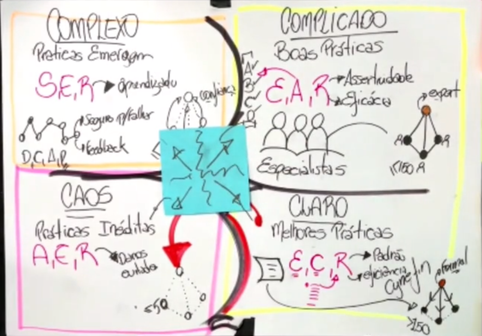

# Métodos Ágeis I

Os trabalhos nas empresas se dividem em duas categorias: aqueles que servem para mantê-la funcionando de forma a cumprir seus objetivos e aqueles que buscam mudanças e melhorias, ou seja, ao mesmo tempo em uma empresa existem pessoas que estão trabalhando para ela mudar enquanto outras trabalham para ela não mudar. E isso não significa que elas estão umas contra as outras, sendo essas duas categorias de trabalho muito importantes para o sucesso de uma companhia.

Os trabalhos que tem como objetivo manter a empresa como está são aqueles que procuram manter a qualidade no que já existe, para que os objetivos continuem sendo atingidos com sucesso e qualidade. Essas pessoas trabalham com PROCESSOS. Já aqueles que trabalham para construir algo novo e único para a empresa afim de trazer ganhos trabalham com PROJETOS.

Projetos (*Project Driven*):

- Criam algo único;
- Mudam o negócio;
- Gerenciam riscos, que são inerentes aos projetos;
- Equipes transversais;
- Finitos;
- Tendem a modificar o "status quo" e o grande objetivo é terminar/entregar.

Rotinas/Processos (*Process Driven*):

- Ambientes controlados, variáveis conhecidas;
- *Run the business*;
- Mitigam riscos, pois a empresa tem que produzir com qualidade e atenção nos custos;
- Equipes funcionais;
- Contínuas;
- Tendem a manter o "status quo", com o objetivo de serem constantemente aprimorados.

"*The only thing constant in life is change*"

## :one: O que é mudança?

## :two: Tipos de mudanças

Mudanças incrementais buscam melhorar, somar, acrescentar ou agregar algo a um produto mas mantendo sua essência. Mudanças transformacionais trazem uma redefinição para o produto, isto é, ele pode continuar tendo o mesmo objetivo, mas serão buscados novos métodos e processos para atingí-los (exige mais energia e são mais caras).

O óleo de cozinha é um exemplo de como as mudanças incrementais não são o bastante, sendo necessário algo disruptivo (isto é, que interrompe um ciclo para começar outro) pois o produto uma hora atinge um limite e não há mais como melhorá-lo. No início da década de 1930, o óleo de cozinha foi inventado e por conta da popularização dos fast foods ele começou a fazer parte da alimentação básicas dos humanos. Porém, por conta dos riscos a saúde que ele traz, como excesso de gordura e problemas cardíacos, ao longo dos anos foram criadas alternativas utilizando Milho, Canola e Girassol que não fossem tão prejudiciais a humanidade. Porém, um dia não foi possível mais avançar em melhorias e foi necessário começar a pensar em novas alternativas e então surgiram as AirFryers

As mudanças de matéria prima para a produção do óleo são mudanças incrementais ao produto, enquanto as AirFryers são uma mudança disruptiva, isto é, uma mudança transformacional.

## :three: Inovação Contínua

Em um artigo de Steven Blank chamado Innovation at 50 times, o modelo de negócio de uma empresa (forma como a empresa entrega valor para o cliente) no século 20 tinha um prazo de validade máximo de 60 anos. Ao longo desse período haveriam mudanças incrementais mas após isso seria necessário inovar de forma disruptiva (transformacional), isto é, mudar seu modelo de negócio.

Nesses sessenta anos, nos trinta primeiros a companhia experimentaria de um período de alta até alcançar um pico e nos outros trinta começaria entrar em declínio. Portanto, a empresa possuiria todo esse período de declínio para começar a projetar um novo modelo de negócio para trazer inovação e começar a crescer novamente.

A empresa sabendo que possui todo esse período para inovar, deve lidar com o delta, destacado na imagem abaixo em vermelho, que é a perda de valor da empresa até que o novo modelo de negócio esteja no mesmo nível que o anterior estava.

As empresas aprenderam a lidar com esse ciclo, porém, os avanços tecnológicos causaram uma mudança nele que diminuiu seu tempo de sessenta para vinte anos, isto é, a cada vinte anos será necessário interromper seu modelo de negócio e realizar alguma mudança disruptiva, tendo dez anos de ascenção e outros dez de declínio. Portanto, as empresas teriam algo em torno de 5 anos, a partir do início do declínio no seu valor para conseguir implementar uma inovação para conseguir continuar no mercado de forma competitiva.

Sendo assim, se nos dias de hoje uma empresa esperar os primeiros sinais de queda para começar um projeto de inovação, ela não irá conseguir realizá-lo a tempo, sendo necessário que a inovação deixe de ser um projeto com início, meio e fim e comece a ser tratado como algo contínuo, passando a ser um processo.

"*A inovação contínua requer imaginação e coragem para desafiar as hipóteses iniciais de seu modelo de negócio atual. Isso pode significar competir com seus próprios produtos e, se necessário, acabar com eles*" - Steve Blank

Traduzindo a imagem acima, não devemos mais ficar olhando para o concorrente e esperar que ele comece a machucar o nosso negócio para começarmos a pensar em soluções. Se esperarmos esses movimentos, vamos acabar sendo engolidos pela obsolescência brutal que os dias de hoje traz e sendo varridos do mercado. Devemos começar a olhar para o nosso próprio produto e a pensar em formas de como fazer algo mais inovador.

## :four: Nascimento do SCRUM

Em 1986, Hirotaka Takeuchi e Ikujiro Nonaka fizeram uma publicação chamada "O novo jogo de desenvolvimento de novos produtos". Nessa publicação, os dois viajaram para Estados Unidos e Japão, dois dos países onde estão situadas as companhias mais fortes de mundo e com os maiores índices de inovação, e foram entender porquê algumas delas tinham sucesso nesse processo de inovação mas grande maioria não. Era sorte ou havia alguma espécie de padrão apresentado nessas empresas que tinham sucesso?

Eles identificaram dois fatores que eram o diferencial dessas empresas para as demais:

- **1º Fator: Organização dos Times de Desenvolvimento de Novos Produtos**

  Até aquele momento, as empresas que apresentavam problemas para realizar a inovação organizavam seus times no modelo conhecido como "Passagem de Bastão", onde temos um time responsável pelo levantamento de requisitos, outro para fazer o design da solução e criação dos diagramas, outro que realiza o desenvolvimento, outro para realização dos testes e por fim mais um para colocar o produto em produção.
  Já aquelas que apresentavam sucesso no processo de inovação, todas essas pessoas que trabalhavam com cada uma das etapas do projeto faziam parte de um único time e trabalhavam em conjunto.

- **2º Fator: Ciclo de Desenvolvimento do Produto:**

  O segundo fator é que o projeto não continha um único ciclo, onde no seu início havia um grande plano e no fim um grande produto e sim era iterativo e incremental, isto é, haviam pequenos ciclos e a cada um deles o planejamento, a execução, os testes tudo era melhorado, alterado e incrementado, fazendo com que o produto vá sendo construído ciclo após ciclo.

Esse trabalho em conjunto e a entrega do produto sendo realizado ciclo após ciclos foi comparado ao comportamento de um time de rugbi. Sendo assim, eles decidiram batizar esse método de SCRUM, que é o nome de uma jogada no rúgbi onde os jogadores devem trabalhar todos em conjunto para recuperar a posse da bola.

Nessa época um dos mercados que mais sofria com essa questão dos modelos de trabalho adotado pelas empresas era o setor de desenvolvimento de software e quando esse artigo foi publicado, logo esse público voltou seu interesse para esse modelo e começaram a pesquisá-lo. Foi então que dois homens de um grupo de dezessete pessoas que se juntavam para discutir sobre essas questões, ao ler e conhecer sobre como essas empresas estavam trabalhando através do artigo, decidiram definir e publicar, em 1995, o que eles chamaram de "Metodologia SCRUM", se apropiando do nome e do hype que o artigo vinha tendo no mundo corporativo.

O Scrum nasceu como metodologia e hoje é um framework.

## :five: Manifesto Ágil

Na mesma época do nascimento do SCRUM, outros modelos com o Extreme programming (XP) também surgiram e as empresas começaram a ficar malucas com essas novas metodologias de trabalho e começaram a tentar aplicar em massa em seus negócios. Esses foram intitulados **Métodos Leves**. Acontece que como tudo era muito novo e a oferta ainda era muito baixa, também começaram a surgir outros métodos conhecidos como **Caóticos**, que se vendiam como leves, mas na verdade eles só eliminavam partes do ciclo de trabalho, como documentação e testes, tornando os projetos bombas relógios que em algum momento iam explodir por conta da queda de qualidade nas entregas. Vendo para onde estava indo a reputação dos chamados métodos leves, os dezessete idealizadores iniciais do SCRUM decidiram se reunir para publicar, em 2001, um manifesto com os princípios que devem ser respeitados para um método poder ser chamado de leve. Acontece que o nome leve já havia sido mal interpretado e não poderia ser adotado no manifesto e portanto, decidiram aplicar o nome **Ágil**.

"*Ágil é acima de tudo LEVE e ADAPTATIVO.*"

Os quatro valores do Manifesto Ágil:

1. **Indivíduos e Interações são mais importantes do que Processos e Ferramentas:** nenhum modelo de trabalho tem a prerrogativa de tratar as pessoas mal, portanto, o manifesto ágil não fala sobre preferir indivíduos e as interações porque somos bonzinhos e sim porque os processos e ferramentas não conseguem se adaptar a esse modelo mais leve;

2. **Preterir Software Funcionando à Documentação Extensa:** Isso não significa que não haverá documentação e sim que ela virá após a implementação, uma vez que até tudo estar funcionando não sabemos como de fato as coisas ocorrem, então se perdermos tempo com documentação antes, é bem capaz que documentemos coisas erradas;

3. **Colaboração com o Cliente ao invés de Negociação de Contratos:** Se amarrarmos os objetivos em contratos, pode ser que ao longo do tempo eles acabem mudando, fazendo com que o time fique amarrado em entregar o que está em contrato, podendo não fazer mais sentido em algum momento e impedindo que seja feito o que de fato é necessário;

4. **Responder a mudanças mais do que seguir um plano:** Há plano, porém, se precisarmos mudar, mudamos e depois adaptamos o plano.

Os três pilares do Scrum:

1. **Transparência:** Todas as informações devem estar disponíveis e acessíveis a todos os membros da equipe, promovendo a confiança e colaboração, e permitindo que todos no projeto tenham compreensão clara do que está acontecendo, podendo tomar posições embasadas e alinhadas com os objetivos do projeto.

2. **Inspeção:** Realizar avaliação contínua do trabalho através de uma abordagem iterativa e incremental para encontrar pontos de melhoria no produto. É importante que a equipe esteja aberta a feedbacks e pronta para realizar ajustes e correções necessárias para melhorar o produto. Isso permite uma análise criteriosa do progresso do projeto, garantindo a qualidade e entrega de valor.

3. **Adaptação:** O ambiente onde os projetos são desenvolvidos são dinâmicos e incertos, sendo a adaptação fundamental para responder as mudanças que ocorrem ao longo do tempo. Os feedbacks e aprendizados obtidos durante a etapa de inspeção permite a equipe realizar ajustes e mudanças tanto no produto quanto no processo de trabalho.

Os três pilares estão interligados e se fortalecem mutuamente. A transparência é necessária para que a inspeção possa ser realizada de forma efetiva e a inspeção alimenta a adaptação com informações relevantes para a tomada de decisão.

## :six: Primeiro de Tudo: Entender o Problema

"*Se não houver problema, não há solução e não há razão para existir uma empresa*" - Vinod Khosla

"*Se eu tivesse uma hora para resolver um problema e minha vida dependesse da solução, eu passaria os primeiros 55 minutos determinando a pergunta adequada para perguntar, uma vez que eu soubesse a pergunta adequada, eu poderia resolver o problema em menos de 5 minutos.*" - Albert Einstein

O professor deu o exemplo da ponte Choluteca, construída em Honduras e tinha como objetivo permitir que as pessoas atravessassem o rio de mesmo nome por vias terrestres. Acontece que o requisito para a construção dessa ponte é que ela fosse resistentes a possíveis desastres naturais que aconteciam na região. Após a construção, houve um furacão que devastou a região e a ponte, como proposto, ficou intacta. Acontece que outro fenômeno que acontecia na região e não foi levado em consideração era de que esses desastres naturais poderiam mudar a posição do rio, que de fato ocorreu, ficando a ponte suspensa sob terra e fora do mar, tornando-se totalmente inútil. Isso mostra que os responsáveis pelo projeto não conheciam a totalidade do problema, gerando um resultado final ineficaz e que não resolvendo a questão. Foram necessários novos gastos para arrumar a ponte e permitir que ela cumprisse o seu papel.

Problemas precisam ser **consistentes**, isto é, precisa ser compreendidos pelas pessoas que o analisam e **relevantes**, ou seja, eles merecem ser resolvidos.

### :arrow_right: Mapa do Problema

O professor mostrou uma ferramenta interessantes para utilizarmos quando estamos tentando entender um problema e verificar a sua relevância:

1. **Contexto do Problema:** Nesse passo temos uma descrição do problema. Tomando o exemplo da ponte Choluteca, por exemplo, o contexto seria que seria necessária a construção de uma ponte para ligar as duas margens do rio;

2. **Consequências/Efeitos Conhecidos:** Quais os efeitos da não resolução desse problema. A não construção da ponte pode ter efeitos econômicos, energéticos ou até mesmo de relacionamento entre as pessoas que se encontram em cada uma das margens;

3. **Causas Identificadas:** Quais as caractéristicas do ambiente no qual o problema de aplica? Nessa etapa muito provavelmente apareceria a questão de que a região é muito propícia para furacões e que o terreno permite a mudança na disposição do rio;

4. **Pessoas impactadas ou envolvidas (Direta ou indiretamente):** Ao final dessas quatro primeiras etapas, conseguimos ter um problema consistente. Nas duas próximas etapas vamos tentar entender se ele merece ser resolvido.

5. **Importância:** Entender qual a importância (ou ganho) de se solucionar esse problema. Nesse momento podem ser utilizadas diferentes métricas, como financeira, tempo, algum KPI interno da empresa, etc. Conectar com o planejamento estratégico da empresa;

6. **Realidade X Ideal:** Como é a situação atual do problema e qual seria o ideal? Estamos demorando quinze dias para atender nossos clientes e o ideal é que precisassemos de apenas três.

Ter clareza e conseguir mediar o que separa você do estado atual para o futuro é fundamental.

### :arrow_right: Estágios do Problema

Após entender o problema e ele é relevante ou não, o próximo passo é entender o estágio em que o problema se encontra:

1. **Problem Solution Fit:** Encontrar uma solução para o problema;

2. **Product Market Fit:** A implantação da solução do problema vai necessitar alguma mudança de comportamento dos envolvidos? De nada adianta entregarmos algo e as pessoas não confiarem e continuarem utilizando os métodos antigos;

3. **Scale:** Todas as pessoas impactadas conseguem utilizar a solução? Ou apenas uma parte delas?

Nem todos os problemas encontram-se no mesmo estágio e passam por todos eles.

"*Se o projeto não é um fim em sí mesmo e eu não sei a pergunta que ele quer responder, eu não saberei quando ela estará respondida e quando acabar o projeto.*"

### :arrow_right: Como Obter Conhecimento?

Onde obter conhecimento para resolver um problema?

Temos duas linhas de pensamento sobre a obtenção do conhecimento defendidas por René Descartes e John Locke. Na visão de Descartes, o conhecimento era obtido a partir de experiências passadas, enquanto Locke defendia que o conhecimento era obtido de forma empírica, isto é, a partir da experimentação. Havia quem defendia uma das visões e essa discussão seguiu até que Immanuel Kant concluiu que não existia uma única visão correta e sim que elas deveriam ser utilizadas em momentos diferentes, ou seja, há momento em que eu preciso me basear em problemas do passado e há momentos em que o conhecimento do passado não é suficiente e precisamos de algo novo.

Se o problema já é de conhecimento e as soluções existente para ele ainda são válidas, chamamos esse de um problema **conhecido**. Se o problema é novo ou já teve uma solução no passado mas que não serve mais, esses são problemas **conhecíveis**. Por fim, aqueles problema inimagináveis e que ainda não temos conhecimento, são os **incognoscíveis**.

Um exemplo de problema conhecido é quando temos dois pontos em um plano bidimensional e precisamos conectá-los. Até os dias atuais, comprovado através da matemática, a melhor forma de solucionar esse problema é conectando os dois pontos através de uma reta. Nesse caso, utilizamos de um conhecimento do passado para resolver um problema que hoje já possui solução. Para esses tipos de problemas podemos utilizar de **processos preditivos** (PDCA - *Plan, Do, Check, Act*).

Um exemplo de problema conhecível, por sua vez, é o jogo do "ta quente/ta frio", que consiste de uma pessoa esconder um objeto e outra ter que encontrá-lo, mas para receber dicas da pessoa que escondeu, deve perguntar se está quente (isto é, está perto do objeto) ou está frio (está longe do objeto). Nesse problema, é impossível você se planejar antes de encontrar o objeto, é necessário dar pequenos passos, interpretá-los e a partir dos resultados obtidos definir o próximo passo. Por exemplo, se dou um passo para a esquerda e a pessoa diz que ta frio e dou um pra trás e a pessoa disse que está mais frio ainda, eu já sei que não devo andar nessas duas direções de agora em diante. Da mesma forma que não adianta eu dar grandes passos, pois posso depois ficar tão longe de onde o objeto está, que vou precisar implicar mais esforço (nesse caso, dar mais passos), para atingir o meu objetivo. A esse modelo de resolução de problemas chamamos de **processos adaptativos** (DCAP - *Do, Check, Act, Plan*) e é nesse tipo de processo que os modelos ágeis se baseiam.

- Esses pequenos passos que damos a cada rodada da partida damos o nome de sprint e ao final de cada uma delas, conseguimos alterar o nosso plano (no exemplo do jogo, alterar a direção), para atingir nosso objetivo;

- O professor passou a parte do filme "Fome de Poder" onde os dois idealizadores do modelo de negócio do McDonald's contam como chegaram na solução para o seu problema, que era diminuir o tempo de preparo de um hamburguer de 30 minutos para 30 segundos. Para fazer isso eles utilizaram de uma quadra de tênis, desenharam a posição dos equipamentos utilizando giz de cera na quadra e chamaram os funcionários para realizar testes em cima dos esquemas que eles criaram (*Do*). Porém, o modelo de primeira não obteve o resultado esperado (*Check*), portanto, foram necessários ajustes (*Act*) e feitos testes novamente até se obter o resultado esperado (*Plan*). Se eles primeiros tivessem planejado a cozinha, reformado ela toda e depois testado se a disposição era adequada, eles iriam ter gastado dinheiro e tempo de forma ineficiente, e iriam precisar gastar mais e perder mais tempo para reformar de novo sem ter certeza que o novo resultado seria o esperado. Isso mostra o quanto dar pequenos passos é bem mais eficiente do que planejar tudo antes da execução, pois ajustes de rota muito provavelmente serão necessários ao longo do projeto.

Qualquer opinião que diga que um modelo é melhor do que outro parte de um conhecimento raso, pois cada um dos modelos vai depender do contexto de cada problema.

- A abordagem preditiva exige conhecimento do problema de forma antecipada e possuem poucas iterações;
- A abordagem adaptativa, por sua vez, é um processo incremental e que possui diversas iterações, sendo mais adequada em cenários onde não temos como definir uma solução para o problema previamente a seu desenvolvimento e o caminho é construído pouco a pouco;
- A abordagem híbrida é quando temos uma quantidade de incerteza proporcional a quantidade de certeza, portanto, utilizamos as duas abordagens.

## :seven: O que é Ágil?

- Processo adaptativo;
- Construção de ambiente para receber tanto notícias boas quanto ruins (ta quente/ta frio);
- Feedbacks são importantes (quanto mais em tempo real melhor) ajudam a definir o caminho que devemos seguir.

## :eight: Abordagem Preditiva x Adaptativa

A Abordagem Preditiva é utilizada quando é possível prever com grau de certeza o que será entregue (escopo), quando (tempo), quanto vai custar (orçamento), pessoas e riscos envolvidos, sendo possível coletar os requisitos no início do projeto.

Esse método também é chamado de Waterfall ou Cascata.

Na abordagem adaptativa, temos inicialmente uma ideia. Criamos suposições sobre essa ideia, como o que o produto deve fazer e armazenamos em um backlog. É selecionado então um item desse backlog e implementado. No final da implementação, os resultados são apresentados para os interessados e esses darão seu feedback se o projeto está indo para o caminho certo ou não e baseado nesse feedback, o plano é ajustado e esse ciclo repetido indefinidamente.

## :nine: Cynefin

É um Framework para categorização de problemas que ajuda na tomada de decisões.

### :arrow_right: Claro (Melhores Práticas)

Problemas categorizados como **Claros** são aqueles que já existem uma receita (ou melhores práticas) para resolvê-lo, isto é, entre um universo de diferentes formas de se solucionar uma determinada questão, uma delas se destaca diante das demais.

Um exemplo prático desse modelo é uma fábrica de pães. O dono da padaria sabe a receita para se criar o melhor pão possível. Em uma fábrica de automóveis, a companhia tem o passo a passo para se construir um determinado carro. Em ambos os casos, esse modelo deve ser seguido.

Essa abordagem consiste em **entender** o problema, **categorizá-lo**, isto é, elencar entre as possíveis soluções da melhor a pior, selecionar a mais bem colocada e utilizá-la para resolver o problema.

Para medir o sucesso da resolução do problema podemos utilizar como métricas um padrão e a eficiência, ou seja, se temos uma receita de como atingir determinado objetivo, sabemos o que queremos, logo, conseguimos comparar o resultado final real com o esperado e definir se o objetivo foi batido ou não. Esse tipo de método também prega a eficiência, uma vez que já se sabe o caminho para o resultado e não é necessário perder tempo com elaboração de soluções.

Esse tipo de projeto pode ser aplicado para times grandes (mais de cento e cinquenta pessoas) que possuam forte dependência de uma liderança e pouca entre seus membros, uma vez que já se sabe como solucionar a questão, não sendo necessário brainstorms em equipe para encontrar uma resposta, bastando o líder a orientá-los a cumprir o processo.

### :arrow_right: Complicado (Boas Práticas)

Diferentemente dos problemas categorizados como claros, os **Complicados** são aqueles que não possuem uma única solução eficiente e sim várias, sendo necessário avaliar qual dessas soluções é a mais adequada de acordo com o contexto do problema.

Nesse caso ainda vamos precisar de um líder com forte vínculo de dependência com seus subordinados, porém, esses subordinados deveram ter um forte vínculo também entre sí para conversarem e determinarem qual o melhor caminho a se seguir.

Esses subordinados são conhecidos como **Especialistas** e é tarefa do líder conhecer e selecionar as pessoais para os projetos de acordo com os seus atributos, por isso dizem que esses grupos devem ser formados por no máximo 150 pessoas, que segundo pesquisas, é o número máximo de indivíduos que conseguimos estabelecer uma conexão significativa e ter conhecimento pleno de cada uma delas.

Para medir a qualidade do trabalho não devemos utilizar uma métrica como padrão, pois se os especialistas estiverem apontando sempre a mesma solução para os problemas, é bem possível que ele não esteja fazendo uma análise precisa de como solucionar o problema. Nesse caso devemos medir a qualidade através da assertividade e da eficácia das soluções propostas.

- Por exemplo, não medimos a qualidade de um médico se ele da sempre o mesmo remédio para todos os seus pacientes e que atende muitas pessoas em um curto espaço de tempo. É bem possível que esse médico esteja cometendo equívocos, pois cada caso é um caso e velocidade não é sinônimo de qualidade. O bom médico nesse caso é aquele que possui maior taxa de assertividade no método adotado para tratar o seu paciente e eficácia no tratamento, isto é, conseguiu curar mais pacientes.

### :arrow_right: Complexo (Práticas Emergem)

Tanto os claros quanto os complicados são problemas do passado, conforme pensado por Descartes, onde já se conhece o problema e as soluções viáveis para resolvê-lo, podendo ser feito um planejamento prévio anterior a aplicação prática.

"*Penso logo existo*"

Ao contrário das duas categorias anteriores que olham para o passado, os problemas complexos olham para o presente e é onde os métodos ágeis e o DCAP se encaixa.

Nesse caso, não sabemos com exatidão como resolver um determinado problema, portanto, damos pequenos passos (lembre do ta quente/ta frio) e **sondamos**, isto é, seguimos por um caminho que acreditamos que seja o correto. Após a aplicação, procuramos **entender** o que foi feito e seus resultados para sabermos se estamos no caminho certo e **respondemos** a essa análise, ou seja, ajustamos a rota para o próximo passo.

Nesse tipo de projeto, medimos a qualidade do trabalho de acordo com o aprendizado da equipe, portanto, devemos criar ambientes que permitam erros para encorajar os membros da equipe a se arriscarem, que forneçam feedbacks constantes e valorizem o aprendizado ao longo do tempo. Se tentarmos medir a qualidade do trabalho através da assertividade e eficácia, podemos acabar desencorajando os membros da equipe de errar.

Nesse modelo não devemos ter membros da equipe com forte dependência de um líder, porém, esses devem ter forte envolvimento entre sí para fazerem o trabalho sem ter um chefe que diga o que deva ser feito. O líder deve ser alguém que encoraja seus comandados.

"*Transformar algo que está errado em algo que está certo.*"

"*Transformar veneno em remédio.*"

"*Parar de namorar com a inovação e casar com ela.*"

O professor deu exemplo do homem que descobriu um método para extração do Grafeno a partir de experimentações despretensiosas encorajadas pelo laboratório onde ele trabalhava, como fazer uma rã voar utilizando semicondutores.

A quantidade máxima de pessoas que podem trabalhar em uma equipe dessa são 15, que segundo pesquisas é o número máximo de pessoas que conseguimos ter confiança a ponto de aceitar "pequenas traições". No caso de um projeto, essas pequenas traições seriam erros cometidos ao longo dos ciclos e nossas equipes devem ser capazes de entenderem que o erro de seus parceiros assim como os seus fazem parte do projeto e que não devemos perder a confiança.

"*Estabelecer a cultura da confiança.*"

### :arrow_right: Caos (Práticas Inéditas)

"*Todos os cogumelos são comestíveis, porém alguns apenas uma vez.*"

Tudo acontece como se fosse a primeira vez e é preciso **agir** rapidamente e só depois tentar **entender** o que está acontecendo. Ao final desse estágio, você se encontrará em um dos demais mas nem sempre bem.

Nesses casos a métrica para analisar a qualidade do trabalho são a quantidade de danos sanados pela equipe e nesse caso devemos trabalhar em equipes pequenas de no máximo cinco pessoas.

Uma forma muito comum de cair no caos é quando temos um problema claro que é resolvido através de um processo e por algum motivo as pessoas deixam de seguir essa melhor prática ocasionando em um grande problema onde depois as pessoas não sabem o que fazer e como agir, gerando estresse.

"*Pode subir em produção sem testar, confia.*"

"*Pode apagar essa coluna da tabela, ninguém utiliza, relaxa.*"

"*'Confia' é a palavra que precede a morte.*"

"*Resolva do jeito que der.*"

### :arrow_right: Confuso

Não sabemos em qual das categorias o problema se encaixa ou achamos que ele se encaixa em mais de um. Nesse caso, vale a pena quebrar o problema em partes menores.

Quando mais para a esquerda no gráfico do Cynefin, o empirismo vai sendo deixado de lado (já sabemos como resolver o problema) assim como quando mais para cima, menos determinístico ele se torna (sabemos como resolver, mas temos mais de uma possibilidade de solução). No caso da categoria dos problemas confusos, nesse caso não existe projeto e as pessoas estão apenas preocupadas em resolver o problema, seja lá como.

