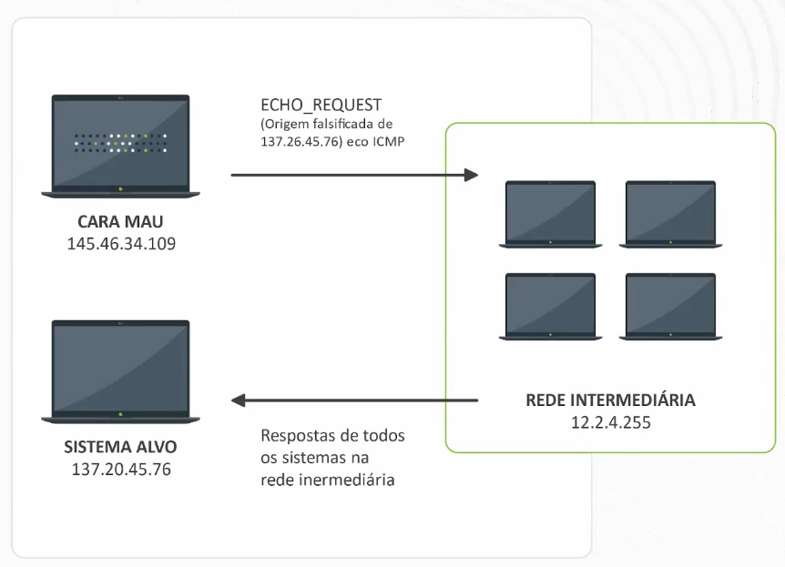

# Fundamentos da Segurança da Informação I

## :one: Introdução

Discutir segurança da informação nos dias de hoje é um tema muito importante, pois estamos cada vez mais vivendo em um mundo conectado (tênis, relógios, óculos, roupas, carros entre outros objetos).

- Até 2025 teremos 22 bilhões de aparelhos IoT (Internet of Things - Internet das Coisas) conectados a rede mundial de computadores.

Várias empresas de grande porte nos últimos tempos apareceram no noticiário por terem sido hackeadas:

- Microsoft (falhas no Azure e Outlook);
- Carro autônomo da Tesla (imagina o perigo de se deixar o controle de um carro autônomo na mão de um hacker e o que ele pode fazer com os passageiros);
- Documentos comerciais da Airbus;
- Imagens do GTA VI da RockStar.

## :two: Princípios

A segurança de um sistema, aplicação ou protocolo é sempre relacionada à:

- Conjunto de propriedades desejadas;
- Um adversário com capacidades específicas.

### :arrow_right: Importância da segurança

- Proteção de patrimônio (em especial: informação);
- Vantagem competitiva (ex. fórmula da Coca-Cola);
- Cumprimento de responsabilidades;
- Continuidade de operação/atividade.

### :arrow_right: O que compõe a Segurança da Informação?

```Segurança
Segurança da Informação = proteção + integridade + disponibilidade + autenticação
```

### :arrow_right: Prática

- Prevenção: instruir os funcionários (essencial), fazer com que eles fiquem a par das politicas da empresa, entender o funcionamento, treinamentos. O ponto mais fraco de qualquer empresa é o ser humano;
- Detecção: comportamentos anormais, métricas de comparação;
- Resposta.

### :arrow_right: Planejamento

Segurança é relativa, pode ser tomada em níveis e deve ser um balaceamento (isto é, se a informação não é tão sensível ou não existem pessoas interessadas em obtê-las, talvez não faça sentido investirmos tanto em segurança):

- Custo da Segurança X Valor do Patrimônio (a formula da coca cola é de extrema importancia pra coca cola então deve investir ao máximo para mantê-la segura);
- Provável x Possível (existem pessoas interessadas na informação?);
- Necessidade de segurança x do negócio.

Todo estudo de implementação de um sistema de segurança se inicia com a **análise de risco**:

- **Identificar e priorizar valores (patrimônio):** o que é mais crítico e necessita de proteção?
- **Identificar vulnerabilidades:** quais são os pontos vuneráveis que a empresa apresenta e que pode promover a integridade desse patrimônio?
- **Identificar ameaças e suas probabilidades:** existem ameaças interessadas em prejudiar meu patrimônio?
- **Identificar contramedidas:** o que podemos fazer contra essas ameaças e para nos prevenir dessas vulnerabilidades?
- **Desenvolver análise de custo-beneficio:** vale a pena o investimento em segurança? A danificação desse patrimônio me trará prejuízos irreparáveis, sendo de interesse implementar medidas de segurança?
- **Planejar políticas e procedimentos de segurança.**

### :arrow_right: Pilares da Segurança da Informação

**Confidencialidade:** proteção da informação contra descoberta ou interceptação não autorizada; privacidade.

- Necessário em áreas sensíveis: instituições governamentais/militares;
- Acesso restrito aqueles que necessitam dela;
- Companhias com projetos proprietários;
- Mecanismo: criptografia (tem que ter cuidado com as chaves!);
- Computação quântica é um ponto de atenção pra criptografia.

**Integridade:** impedir informação/transmissão de ser alterada/danificada de forma não autorizada, imprevista ou acidental.

- Confiança nos dados ou recursos;
- Relacionado à prevenção de mudanças;
- Impróprias ou não autorizadas;
- Integridade dos dados (o conteúdo da informação não foi alterado);
- Aspecto importante: credibilidade;
- Dividido em duas partes: prevenção e detecção

  - Prevenção: manter a integridade pelo bloqueio de qualquer tentativa não autorizada de modificação dos dados ou tentativas de modificar o dado de maneira não autorizada. Exemplos:
    - Usuário tenta mudar dado sem autoridade para tal (intruso mexer nos registros de um contador);
    - Usuario autorizado tenta mudar dado de outras maneiras não correspondentes a sua autorização (contador sonegar impostos);

  - Detecção: alertam que a integridade dos dados não foi preservada.
    - Garantia depende de premissas sobre a fonte e a confiança nesta fonte;
    - Avaliação inclui corretude e confiança do dado: como e de quem foi obtido? O caminho do dado foi protegido? O destino do dado é protegido?

**Disponibilidade:** confiabilidade de redes, sistemas e equipamentos sobre evitar ou se recuperar de interrupções.

- Habilidade de se usar a informação ou recurso desejado;
- Sistema indisponível é tão ruim quanto um sistema inexistente;
- Para um e-commerce um dia de indisponibilidade causa perdas financeiras significativas;
- Exemplo: projetos de sistemas podem assumir um modelo estatístico para analisar padroes de uso esperado

  - Tentativas de bloquear a disponibilidade são dificeis de se detectar: o padrão de acesso incomum é uma anomalia momentânea, uma falha de dispositivo/recurso ou um ataque proposital?
  - O Sisu só recebe altas requisições em períodos de inscrição, fora disso é estranho um alto volume... mas e em um e-commerce?

- DDoS

### :arrow_right: Requisitos de Segurança

**Identificação e Autenticação:** distinguir, determinar e validar a identidade do usuário/entidade (se é quem diz ser);

**Controle de acesso:** limitar/controlar nível de autorizações de usuários/entidades a uma rede, sistema ou informação;

**Não-repúdio:** impedir que seja negada a autoria ou ocorrência de um envio ou recepção de informação.

## :three: Ameaças e Ataques

### :arrow_right: Vulnerabilidade

Fraqueza inerente de um elemento do sistema;
Brecha: ponto fraco ou falha que pode ser explorado.
Principais origens:

- Deficiência de projeto: brecha no hardware/software;
- Deficiência de implementação: instalação/configuração incorreta, por inexperiência, falta de treinamento ou desleixo;
- Deficiência de gerenciamento: procedimentos inadequados, verificações e monitoramento insuficiente.

Exemplos:

- Instalação física: má proteção física de equipamentos e mídia;
- Hardware e Software: situações não previstas, limites, bugs no projeto, deixando brechas que podem ser exploradas.

Humano sempre é o ponto mais fraco de qualquer sistema.

### :arrow_right:  Ameaça

Qualquer coisa que possa afetar ou atingir o funcionamento, operação, disponibilidade, integridade da rede ou sistema.

### :arrow_right: Ataque

Técnica específica usada para explorar uma vulnerabilidade.

Tipos de ataques:


Esses ataques ainda podem ser classificados entre passivos (interceptação, monitoramento, análise de tráfego) e ativos (adulteração, fraude, reprodução ou imitação e bloqueio).

### :arrow_right: Motivações

- Dinheiro: venda de dados e extorsão;
- Poder;
- Vingança: ciúme;
- Fama e curiosidade;
- Oportunidade e dificuldade financeira.

### :arrow_right: Contramedidas

Técnicas ou métodos usados para se defender contra ataques, ou para fechar ou compensar vulnerabilidades. Exemplo: Honeypot.

### :arrow_right: Passos de um Ataque

Um ataque consiste de um conjunto de etapas para ter sucesso:

- Reconhecimento e enumeração: O levantamento de dados do alvo é feito tanto a nível de sistema quanto de indivíduo.

  - Sistema:

    - Footprint:
      - Scan - map;
      - Topologia da rede, serviços, SO, Versões;
      - Funcionamento da empresa (funcionários, acessos).

    - Fingerprint:
      - Versão de protocolo;
      - Buscar explot.

- Ganho de acesso (intrusão);
- Manutenção do controle (persistência);
- Ocultação de traços (limpeza);
- Fazer o alvo trabalhar para o atacante: consigo utilizar essa máquina de trampolim para outra?

### :arrow_right: Tipos de Ataques

#### Obtenção de Informações

- **Engenharia Social:** O atacante faz uso da persuasão para obter informações relacionadas ao usuário e esses dados podem ser utilizados para montar dicionários e realizar ataques de força bruta para obter acesso a computadores e informações sobre o mesmo. Comumente ocorre com pessoas se passando por empresas ou pessoas conhecidas para capturar informações;

- **Phishing:** Tipo de fraude que se dá por meio do envio de mensagem não solicitada, passando-se por comunicação de uma instituição conhecida, como um banco, empresa ou site popular, e que procura induzir o acesso a páginas fraudulentas projetadas para furtar dados pessoas e financeiros do usuário. Exemplo: e-mail falso de empresa oferecendo desconto nos seus produtos;

- **Packet Sniffing:** Técnica que consiste na captura de informações valiosas diretamente pelo fluxo de pacotes. Também conhecida como passive *eavesdropping*. São utilizados os chamados *Sniffers*, dispositivos ou softwares que capturam e armazenam dados trafegando em uma rede de computadores. Os mais famosos são o tcpdump, o Ethereal e o Wireshark;

- **Scanning:** São ferramentas utilizadas para obtenção de informações referentes aos serviços que são acessíveis e definidas por meio do mapeamento das portas TCP e UDP. O intuito desse tipo de ataque é evitar o desperdício de esforço com ataques a serviços inexistentes. A ferramenta mais conhecida é o **nmap**, que pode ser empregado para realizar a auditoria do firewall e do IDS;

- **Spoofing:** Entrar no meio de uma conexão e começar a retornar pacotes fraudulentos, com origem em um host confiável, para obter acesso a um sistema. O Spoofing pode ser feito por IP, MAC Address e DNS.

#### Códigos Maliciosos (Malware - Malicious Software)

Esse termo abrange todos os tipos de programas desenvolvidos com o objetivo de executar ações maliciosas em um computador.

- **Vírus:** Cada vírus tem um propósito específico. É um programa ou parte de programa que se propaga infectando, isto é, inserindo cópias de si mesmo e se tornando parte de outros programas e arquivos de um computador. Ele depende da execução do programa ou arquivo hospedeiro para que possa se tornar ativo e dar continuidade ao processo de infecção;

- **Worms (Verme):** Programa capaz de se propagar automaticamente através de redes, enviando cópias de sí mesmo de computador para computador. Diferentemente do vírus, ele não necessita da ação do usuário de executar o arquivo em que ele se encontra para iniciá-lo;

- **Cavalo de Tróia (Trojan):** Programa normalmente recebido como um "presente" (cartão virtual, álbum de fotos, protetor de tele, jogo, etc), que além de executar funções para as quais foi aparentemente projetado, executa outras normalmente maliciosas e sem o conhecimento do usuário. Entre as funções que ele pode fazer é instalar screenloggers e keyloggers, além de roubar informações sensíveis como cartões de crédito.

  - A diferença de um Trojan para um Vírus ou Worm é que ele não infecta outros arquivos, nem propaga cópias de si mesmo automaticamente.

- **Adware (Advertising Software):** Tipo de software especificamente projetado para apresentar propagandas. São normalmente incorporados a softwares e serviços, constituindo uma forma legítima de patrocínio ou retorno financeiro para quem desenvolve software livre ou presta serviços gratuitos;

- **Spyware:** Grande categoria de software que tem o objetivo de monitorar atividades de um sistema e enviar as informações coletadas para terceiros.

  - Existem Adwares que podem ser considerados Spywares também pois são projetados para monitorar os hábitos dos usuários durante a navegação e usando isso para direcionar as propagandas que serão apresentadas;
  - Podem ser utilizados de forma legítima, porém, na maioria das vezes são usados de maneira maliciosa.

- **Backdoors:** Programa que permite o retorno de um invasor a um computador comprometido, utilizando serviços criados ou modificados para este fim. A forma mais comum de inclusão de um backdoor é a disponibilização de um novo serviço ou substituição por uma versão alterada, normalmente incluindo recursos que permitam acesso remoto.

  - O Windows XP instalava um backdoor para permitir que os técnicos acessam as máquinas remotamente para corrigir falhas.

  - Pode ser incluído em um Trojan, por exemplo.

- **Keyloggers e Screenloggers:** Os Keyloggers são programas que são capazes de capturar as informações das teclas digitadas pelo usuário e com isso obter textos de e-mails, dados de cartão de crédito ou conta bancária etc e compartilhar isso com os hackers;

  - Para tentar se prevenir a isso, as instituições bancárias adotaram como padrão o uso de teclados virtuais. Então para driblar isso os hackers desenvolveram os Screenloggers, capazes de capturar informações da tela do computador como a posição do cursor e printscreen do monitor nos momentos em que o mouse é clicado.

- **Bots e Botnets:** Sua propagação é similar ao Worm e possui mecanismos de comunicação com o invasor, permitindo que o bot seja controlado remotamente.

  - Muito utilizado para realizar ataques de negação de serviço em outros pontos da internet;
  - Botnets são redes formadas por centenas ou milhares de computadores infectados com bots. Isso permite para o hacker realizar ataques, como phising ou negação de serviço, com muito mais potência;
  - Identificar a presença de um bot em um computador não é uma tarefa simples (mesmo para os programas de antivírus).

- **Rootkits:** Conjunto de programas que fornece mecanismos para que um invasor possa esconder e assegurar sua presença na máquina.

  - O nome não indica que as ferramentas que compõe são usadas para obter acesso privilegiado (root ou Administrator) a um computador, mas sim para mantê-lo.

- **Spam:** Termo usado para se referir a mensagens (não necessariamente e-mails) não solicitadas, mas geralmente enviadas para um grande número de pessoas.

  - São utilizadas para propagar malwares ou páginas falsas (phising) que copiam dados dos usuários.

#### Negação de Serviço (*Denial of Service* - DoS) e Ataques Coordenados (DDoS)

O atacante utiliza um computador para tirar de operação um serviço ou computador(es) conectado(s) à internet. Isso pode ser feito através de:

- Sobrecarga no poder computacional;
- Sobrecarga de tráfego na rede;
- Sobrecarga nos atendimentos de conexão simultânea.

No DDoS é utilizado um conjunto de máquinas para realizar o ataque. Geralmente está associado a ataques a grandes servidores/serviços.

Exemplos de como realizar a negação de um serviço:

- **SYN Flooding:** O ataque é realizado utilizando o handshake de 3-vias para o estebelecimento de conexões TCP. Cliente envia o bit SYN para indicar o desejo de estabelecer conexão, o servidor responde com o SYN-ACK e o atacante não responde com ACK, mantendo a conexão aberta. Ele faz isso até ocupar todo o buffer de conexão no servidor, tornando impossível que clientes legítimos consigam se conectar.

  

- **Ping of Death:** Pode ser utilizado em sistemas que não tratam adequadamento pacotes ICMP maiores do que o normal. A ideia desse ataque consiste em enviar sequência de pings com campo ICMP de tamanho máximo (maior do que o normal), causando estouro do buffer e podendo *crashar* o sistema.

- **Smurf:** Como sabemos, o PING é utilizado para verificar se um endereço existe e se está vivo. O nome se deve ao fato dele ser similar ao jogo de Ping Pong, onde o emissor manda o PING e a ponta verificada responde com PONG, se estiver operacional. Nesse ataque, o atacante manda um série de PINGs em uma rede intermediária, porém, altera o IP de origem no pacote ICMP para o sistema alvo, fazendo com que ele receba todos esses pacotes e cause uma indisponibilidade.

  

#### Formas de Proteção

- Antivírus;
- Anti spam;
- Anti spyware;
- Atualização do sistema;
- Política de segurança.

## :four: Princípios de Segurança para Empresas

- **Economy of Mechanism:** A utilização de mecanismos simples de segurança ajudam os desenvolvedores e usuários a entendê-los mais fácil, tornando a aderência melhor. Por exemplo, o Windows caiu no gosto popular pois além de seguro, é simples de se configurar.

- **Fail-Safe Defaults:** A configuração padrão de um sistema deve ter um esquema de proteção conservador. Por exemplo, quando um usuário novo for inserido em um sistema, suas configurações padrão devem conceder o mínimo de privilégios necessários para que ele consiga realizar suas tarefas.

- **Complete Mediation:** Cada acesso a um determinado recurso deve ser checado para o cumprimento de um regime de proteção. Hoje está muito em uso a autenticação de dois fatores. Existem sistemas, como os bancários, que exigem que o usuário faça um novo login a cada intervalo de tempo (em geral 15 minutos é o intervalo definido).

- **Open Design:** A política de segurança deve ser disponibilizada e de conhecimento de todos. Isso possibilita as pessoas de saber como os processos devem ser realizados e quais os seus direitos e deveres. O nível de informação nesse caso é superficial e não entra em questões de ferramenta.

  - Um projeto aberto possibilita que o sistema seja examinado por várias partes, o que leva a descoberta e correção precoce das vulnerabilidade de seguranças causadas por erro de projeto. Esse princípio é similar ao adotado pelo código aberto.

- **Separation of Privilege:** Separar o acesso a recursos por níveis de acesso de acordo com múltiplas condições pré-estabelecidas.

- **Least Privilege:** Cada programa e usuário de um sistema de computador deve operar com os privilégios mínimos necessários para funcionar corretamente. Em caso de comprometimento de uma conta de aplicativo ou usuário o dano é mínimo.

  - O conceito militar necessidade de saber é um exemplo deste princípio;

- **Least Common Mechanism:** Em sistemas com múltiplos usuários, mecanismos que permitam que os recursos sejam compartilhados por mais de um usuário devem ser minimizados.

- **Psychological Acceptability (Acessibilidade):** Esse princípio estabelece que interfaces de usuário devem ser bem projetadas e intuitivas, e todas as configurações relacionadas à segurança devem aderir ao que um usuário comum poderia esperar.

- **Work Factor:** O custo para viabiliazar a segurança deve ser proporcional ao prejuízo que a falta dele pode causar, isto é, uma faculdade não irá investir para proteger o seu sistema de lançamento de notas de possíveis alunos que desejarem burlá-lo o mesmo que uma organização militar para proteger suas informações de caráter extremamente confidencial.

- **Compromise Recording:** Esse princípio estabelece que, por vezes, é mais desejável gravar os detalhes de uma intrusão do que adotar medidas sofisticadas para evitá-la.

  - Câmeras de vigilância conectadas a internet são um exemplo típico de um sistema de registro que pode ser desenvolvido para proteger um edifício em vez de reforças as portas e janelas;
  - Os servidores em uma rede no escritório podem manter registros de todos os acessos a arquivos, todos os e-mails enviados e recebidos e todas as sessões dos navegadores.
