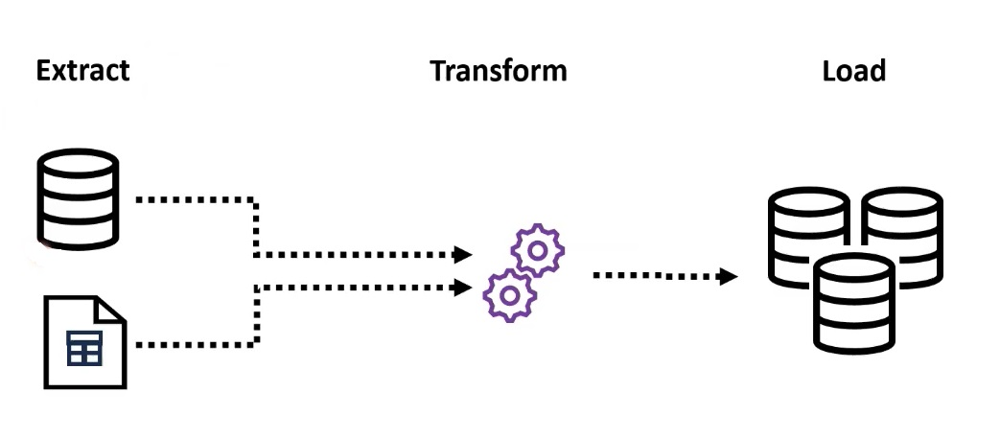

# Engenheiro de Dados I

## :one: ETL

ETL é um acrônimo para **E**xtract **T**ransform **L**oad. Esse é um processo onde extraímos dados de diferentes fontes afim de cruzá-los e gerar novas informações. Por fim, as novas informações geradas são inseridas em uma nova base de dados e disponibilizados para uso das áreas interessadas.

Costumeiramente chamamos as rotinas de ETL de **Pipeline de Dados**.

Exemplos de ferramentas para construção de pipelines de dados:

- Apache Airflow
- Pentaho
- Python
- Informatica
- IBM DataStage

Algumas dessas ferramentas oferecem uma interface gráfica que nos permite visualizar o fluxo dos dados ao longo da rotina de ETL.

## :two: Qual a diferença de um dado estruturado e um semi estruturado?

Na imagem abaixo podemos ver que tanto uma tabela quanto um JSON possuem um padrão estrutural bem definido: no primeiro, cada um dos registros é representado por uma linha, que são um conjunto de colunas que representam os atributos desse registro. No segundo caso, cada registro é delimitado por chaves ({}) e dentro dela existem várias duplas chave/valor, sendo o equivalente a coluna/valor no caso das tabelas.

Porém, por que no primeiro caso dizemos que uma tabela é um dado estruturado e um JSON falamos que é semiestruturado? No caso de uma tabela, os registros possuem uma previsibilidade. O que seria essa previsibilidade? Todos os registros de uma tabela possuem atributos fixos, isto é, que não mudam, mesmo que algumas dessas colunas venham vazias. No caso de um JSON, cada um dos registros podem possuir mais ou menos atributos em relação aos outros, sejam eles exclusivos ou não.

## :three: Quando utilizar bancos relacionais e NoSQL?

Os Bancos Relacionais são mais indicados quando vamos realizar muitas interações com os dados (inserção e atualização). Um exemplo são os bancos transacionais. Por sua vez, os Bancos NoSQL são mais adequados em contextos de Analytics devido a sua alta eficiência em realizar consultas.
