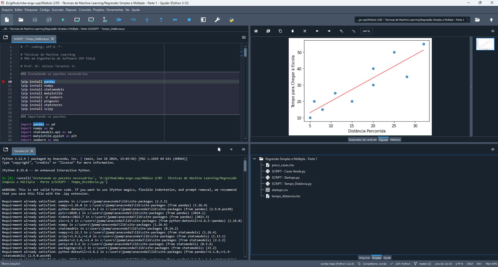

# Técnicas de Machine Learning II

## :one: Ambiente

O **Anaconda** é uma distribuição do Python amplamente utilizada em ciência de dados e aprendizado de máquina. Ele vem com uma série de pacotes pré-instalados que facilitam o trabalho, além de um gerenciador de pacotes conda que permite instalar, atualizar e gerenciar bibliotecas de forma simples. Entre os principais pacotes temos a possibilidade de criação de ambientes virtuais isolados para que seja possível trabalhar em diferentes projetos Python em um mesmo local, mas lidando com bibliotecas e até versões diferentes do Python; Jupyter Notebook, uma ferramenta muito utilizada para criar e compartilhar documentos com código executável.


Outro pacote pré instalado no Anaconda é o **Spyder**, uma IDE (Ambiente de Desenvolvimento Integrado) para programação em Python. Ele fornece em uma única interface o editor de código, a console para visualização dos resultados, um renderizador de variáveis e gráficos e um explorador de arquivos do projeto.



## :two: Código - Regressão Simples - Tempo x Distância

### :arrow_right: Importação das Dependências do Projeto

Na primeira parte do código temos a instalação e importação das bibliotecas necessárias para a execução do projeto, além da importação do banco de dados, no formato de Excel, para dentro do ambiente.


- O `pip` é o gerenciador de pacotes do Python mais conhecido e o comando `pip install` é utilizado para instalar pacotes. Porém, usualmente esse comando tem que ser executado no console previamente ao script. Para que seja possível automatizar essa tarefa dentro do próprio script, basta inserirmos uma exclamação (`!`) no início da linha;

- Quando utilizamos o comando de importação `import ... as ...` estamos obtendo a biblioteca referenciada por inteiro e dando um apelido (*alias*) para facilitar a escrita do código. Quando utilizamos a nomenclatura `from ... import ...`, especificamos o componente dentro da biblioteca que desejamos, não sendo necessário a importação de todo o pacote;

- A sequência de caractéres `#%%` permite a criação de blocos de código dentro de um mesmo script e caso o cursor esteja posicionado em cima da linha de definição do bloco e pressionarmos `Shift + Enter`, todas as linhas daquele bloco são executadas em sequência. O fim de um bloco é delimitado pelo início de outro;

- Para executarmos uma única linha isoladamente devemos pressionar `F9`. É possível selecionar um conjunto de linhas e pressionar a mesma tecla para que apenas elas sejam executadas.

### :arrow_right: Visualização da Base de Dados

Assim que utilizamos a biblioteca do Pandas para importar os dados de um excel, é possível visualizar uma prévia desses dados de forma estruturada no segundo quadrante da interface da IDE clicando em cima da estrutura com nome `alunos` do tipo `DataFrame`:


- DataFrame é um tipo comumente utilizado em Python que armazena dados estruturados em formatos tabulares.

### :arrow_right: Estatísticas Descritivas

No bloco seguinte são executados alguns métodos do próprio objeto DataFrame que permite visualizarmos algumas estatísticas descritivas das nossas variáveis:


- No caso das estatísticas para variáveis do tipo métricas (`tempo`, `distancia` e `semaforos`) foi retornado o número de observações existentes na lista (`count`), a média (`mean`), o desvio padrão (`std`), os valores mínimos e máximos (`min` e `max`, respectivamente) e os quartis (`25%`, `50%` e `75%`).

- No caso das estatísticas para variáveis categóricas (`periodo` e `perfil`) foi retornada a contagem de quantas observações se encaixam em cada uma das categorias.

**Importante:** O modelo foi treinado baseado em valores de distância que variam de 10 à 55. Quando for analisar cenários fora aqueles já conhecidos, tomar cuidado para não extrapolar o valor das variáveis, pois o modelo não está adequado para todo e qualquer cenário, apenas para aqueles que estejam próximos ou dentro a faixa que lhe foi apresentada.

- Exemplo: se fossemos considerar uma distância de 100 quilômetros, provavelmente estaremos falando de uma viagem que envolve rodovia e outros fatores que estão fora da proposta inicial, portanto, o modelo pode acabar não se comportando muito bem.

### :arrow_right: Representação Gráfica

Então utilizamos a biblioteca `seaborn` para plotar um gráfico que pode ser visualizado no segundo quadrante da interface do Spyder:


- O método `regplot` além de renderizar o gráfico, traz uma representação do modelo de regressão linear para o caso espeficado;

- O modelo é representado pela reta vermelha, enquanto os valores do DataFrame (ou observações) são representados pelos pontos em azul.

### :arrow_right: Coeficiente de Correlação de Pearson

Antes de gerarmos o modelo, podemos verificar o coeficiente de correlação de Pearson. Esse coeficiente permite verificarmos a correlação entre as variáveis dependente e explicativa, isto é, se a variável X realmente possui alguma influência sobre Y e qual o sentido dessa influência. Esse coeficiente varia de -1 à +1 e quanto mais próximo dos extremos, maior a influência, sendo o -1 negativa (isto é, quanto maior X menor o valor de Y e vice-versa) e o +1 positivo (isto é, quanto maior X maior Y e quanto menor X menor Y). Quanto mais próximo do 0, significa que a variável X não possui influência sobre o valor de Y.


- Vemos que no exemplo de Tempo x Distância, a variável de distância tem fortíssima influência no valor de tempo estimado;

- Com esse valor podemos inferir o sentido da reta no gráfico, sendo negativo temos uma reta descencente e positivo uma reta ascendente.

### :arrow_right: Criando Modelo de Regressão Linear Simples

Finalmente agora vamos gerar o modelo de Regressão Linear Simples. Para isso utilizamos o módulo `OLS` (Ordinary Least Squares) da biblioteca `statsmodel`, especificamos a fórmula do modelo (isto é, o `Y = f(x)`) que é `tempo ~ distancia` (Lê-se "*tempo em função da distância*") e passamos a base de dados. Para gerar o modelo é utilizado o método `fit`.


- Com o modelo gerado armazenado em `reg_simples`, utilizamos o método `summary` para visualizar alguns dados relacionados ao modelo gerado, entre eles, os valores do intercepto e do coeficiente da distância. Tendo esses valores podemos definir o modelo que explica o tempo em relação a distância percorriada:

  ```Regressão Linear Simples
  Tempo i = 5.8784 + 1.4189 * Distância i
  ```

  - Se substituirmos a variável `Distância i` da equação acima, vamos obter o tempo estimado pelo modelo para se chegar na escola.

Uma interpretação para o Intercepto é que ele é o coeficiente linear, ou seja, o valor da variável dependente caso todas as variáveis explicativas sejam iguais à 0. Porém, podemos também interpretar ele apenas como o ponto de projeção da reta no eixo y, uma vez que seu valor pode não ter relação lógica caso todas as variáveis explicativas sejam zero.

- No exemplo do script, se substituirmos `Distância i` por 0, vamos obter que o tempo para deslocamento até a escola a uma distância de 0 metros é 5,8784 minutos, o que não faz sentido.

Podemos interpretar também os coeficientes das variáveis explicativas como a magnitude que essas tem sobre o fenômeno e que seus valores indicam se a sua influência é positiva, negativa ou neutra.

- Para o caso de uma regressão simples, o coeficiente positivo produz um efeito positivo no modelo (quanto maior X maior Y, quanto menor X menor Y) e a reta será projetada de forma ascendente, por outro lado, caso o coeficiente seja negativo, o efeito em Y será negativo (quanto maior X menor Y e vice-versa) e a reta do modelo será projetada de forma descendente;

- Caso estejamos falando de uma regressão múltipla, cada coeficiente terá sua influência sobre o modelo.

### :arrow_right: Estatística F

Uma das formas de verificar a qualidade do modelo é analisar a estatística F. Ela é utilizada para atestarmos a significância geral do modelo.

A ideia é atestar que pelo menos uma das variáveis explicativas é estatisticamente diferente de 0.

- Não confundir ela ser estatisticamente diferente de 0 com seu valor ser diferente de 0, pois são coisas diferentes.

Normalmente adota-se um nível de significância de até 5% para o teste, isto é, se o P-valor da estatística F for menor do que 0.05, podemos concluir que ao menos uma das variáveis explicativas é estatisticamente diferente de zero e que podemos seguir com esse modelo. Caso contrário, as variáveis X não explicam Y e o modelo é ruim.

No exemplo que estamos tratando a estatística F pode ser visualizada através do comando visualizado na seção anterior em `F-statistic` e `Prob (F-statistic)`. Como o valor de `Prob (F-statistic)` é menor do que 5% (isto é, 0,05), então podemos concluir que o modelo é viável.


### :arrow_right: Estatística T

Após analisar a significância geral do modelo, vamos analisar a significância de cada uma das variáveis explicativas. A ideia é a mesma da anterior, ou seja, se a significância for maior do que 5%, indica que a variável explicativa é estatisticamente igual a zero e, portanto, pode ser removida do modelo.

Essa análise permite o aprimoramento do modelo para que permaneçam apenas as variáveis que de fato auxiliam na predição de Y.

No exemplo que estamos analisando, podemos concluir que a variável `distancia` exerce uma influência estatisticamente significativa no `tempo` para chegar na escola, pois `P>|t|` é menor do que 5%.


Mesmo que o Intercepto seja estatisticamente igual a 0 ele não pode ser removido do modelo, pois ele viabiliza que as regras de MQO sejam respeitadas.

- O alfa tem relação com o tamanho da amostra, se a amostra for maior é capaz que ele seja estatisticamente significativo.

### :arrow_right: Coeficiente de Explicação (R²)

Esse coeficiente que varia entre 0 e 1 apresenta o poder explicativo do modelo, isto é, quanto mais próximo de 1 indica maior capacidade preditiva. Porém, ele não deve ser utilizado para validar ou não o modelo, pois, em muitos campos do conhecimento, é comum não obter valores muito elevados. Use ele apenas para conhecer o seu modelo.

### :arrow_right: Predições para Novas Observações

Por fim, vamos utilizar o modelo gerado para prever o tempo que levará para percorrer uma distância de 30 quilômetros até a escola, valor este não presente na amostra utilizada para treinamento:


Nesse caso o modelo retornou que serão necessários 48,45 minutos para se chegar a escola em uma distância de 30 quilômetros.

## :three: Código - Regressão Múltipla - Tempo x Distância

Vamos tentar melhorar ainda mais o nosso modelo e para isso vamos adicionar uma segunda variável explicativa: a quantidade de semáforos que o indivíduo passa até a escola.

### :arrow_right: Verificando Novamente o Coeficiente de Correlação de Pearson

Verificando o coeficiente de correlação de Pearson vemos que assim como a variável de distância, a quantidade de semáforos também produz um efeito positivo no tempo gasto até se chegar a escola, isto é, quanto mais semáforos durante o trajeto, maior o tempo até o destino.


Utilizando o método `pairplot` biblioteca do Seaborn, podemos também verificar essa correlação positiva entre as variáveis através de uma representação gráfica:


### :arrow_right: Criando Modelo de Regressão Linear Múltipla

Com os mesmos métodos da biblioteca `statsmodel` utilizados para criar o modelo de Regressão Linear Simples, vamos criar o modelo de Regressão Linear Múltipla, sendo a única diferença na fórmula passada no primeiro parâmetro, sendo adicionada a variável `semaforos`.


Analisando as estatísticas F e T, vemos que o modelo e suas variáveis explicativas estão dentro do nível de significância aceitável, inclusive o Intercepto, que anteriormente havia ficado acima do limiar de 5%.

Escrevendo o modelo em equação matemática:

```Regressão Linear Múltipla
Tempo i = 8,1512 + 0,7972 * Distância i + 8,2963 * Semáforos i
```

## :four: Código - Regressão Múltipla com Variáveis Categóricas - Tempo x Distância

Para utilizar as variáveis categóricas `periodo` e `perfil`, será necessário realizar a dummização delas, isto é, transformá-las em variáveis binárias. Portanto, se a vaiável categórica `periodo` possui duas possibilidades de resultados `manhã` e `tarde`, então serão criadas duas novas variáveis `periodo_manhã` e `periodo_tarde` e caso a observação aponte que o trajeto até a escola foi feito pela manhã, a primeira terá o valor 1 e a segunda 0, caso o trajeto tenha sido realizado a tarde, a primeira receberá o valor 0 e a segunda 1. O mesmo ocorre com a variável `perfil`.

Outro aspecto da dummização é que existe uma regra que indica que das novas categorias criadas, apenas n-1 delas será adicionada ao modelo, isto é, será necessário descartar uma delas. No caso de `perfil`, portanto, será necessário descartar `perfil_calmo`, `perfil_moderado` ou `perfil_agressivo`. Aquela descartada será colocada no Intercepto para servir de referência para as demais.

Variáveis antes da Dummização:


Variáveis depois da Dummização:


Existe um método na biblioteca do `pandas` que já realiza essa dummização automaticamente:


O procedimento para criação do modelo é similar aos apresentados anteriores, basta apenas referenciar na fórmula as novas variáveis adicionadas. Quando analisamos o resultado do modelo gerado temos os seguintes resultados:


Analisando os resultado:

- O R² aumentou, isso significa que a capacidade preditiva do modelo é maior se comparado aos dois gerados anteriormente;

- A estatística F permanece dentro do limiar aceitável de 5%, portanto, ao menos um dos coeficiente das variáveis explicativas é diferente de 0, tornando o modelo válido;

- As variáveis `periodo_manhã` e `perfil_moderado` tem seu p-valor acima do limiar de 5%, logo, são estatisticamente iguais a zero e portanto, não possuem relevância sobre o tempo para se chegar na escola.

Para eliminar as variáveis explicativos que não são relevantes para determinar o valor de Y, vamos utilizar o método `stepwise`. Após remover essas variáveis obtemos os seguintes resultados:


- Sobraram apenas três variáveis explicativas no modelo `distancia`, `semaforo` e `perfil_agressivo`, justamente aquelas que respeitaram o p-valor de 5%;

- Podemos interpretar que o período no qual a pessoa está se dirigindo à escola não possui nenhum efeito prático sobre o tempo em que ela demora para chegar ao destino;

- Sobre o perfil do motorista, podemos interpretar que aqueles de perfil `calmo` e `moderado` não possuem nenhuma influência no tempo de trajeto, porém, aquelas de perfil `agressivo` adicionam quase 9 minutos;

- O modelo final é:

  ```Modelo de Regressão Linear Múltipla com Variáveis Categóricas
  Tempo i = 8,29 + 0,71 * Distância i + 7,84 * Semáforos i + 8,97 * Perfil Agressivo i
  ```

## :five: Comparação dos Modelos

Comparando os três modelos utilizando a tabela abaixo, podemos perceber que o resíduo do último modelo gerado `tempo_pred_step` com a presença de variáveis categóricas é menor se comparado aos demais, ou seja, esse modelo possui uma melhor capacidade preditiva.


Analisando esses dados no formato de gráfico temos a constatação dessa análise, pois, sendo uma reta 45 graus considerado o modelo perfeito (isto é, que prevê qualquer cenário com 100% de exatidão), os pontos verdes, que representam o último modelo gerado, estão muito mais próximos da reta.


