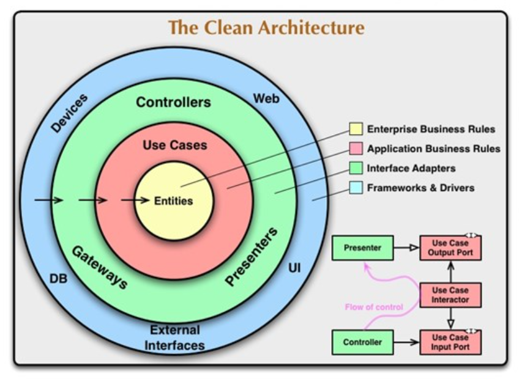

# Arquitetura Limpa (Clean Architecture) I e II

## :one: Introdução

Termo criado em 2012 por Robert C. Martin (também conhecido como Uncle Bob) e tem como foco a redução do acoplamento entre as camadas da aplicação estabelecendo a comunicação entre elas a partir de contratos.

Esse padrão de arquitetura de software não tem como objetivo apontar que as demais existentes estão erradas, sendo apenas mais uma opção. Foi criado a partir de outros vários padrões já existentes no mercado, reunindo o que o autor entendia como as melhores práticas.

Pode ser implementado em (quase) todas as linguagens de programação.

Princípios Fundamentais:

- Independência de frameworks (Arquitetura agnóstica);
- Facilitar testes unitários;
- Evitar acoplamento entre camadas;
- Independência entre regras de negócio e detalhes de implementação;
- As informações sempre vem de fora para dentro.

Uma boa arquitetura é aquela que torna o sistema fácil de entender, desenvolver, manter (ser escalável) e implantar (deploy).

Desafios:

- Complexidade inicial da adoção;
- Impacto em times acostumados com arquiteturas tradicionais;
- Overhead para pequenas aplicações.

Devemos ter em mente que os princípios apresentados são recomendações, porém, em determinados casos nem todos serão possíveis de ser implementados. Por exemplo: a não utilização de frameworks nas regras de negócio nem sempre será possível, dependendo da complexidade de cada projeto.

Na imagem abaixo temos uma representação visual das camadas existentes na arquitetura limpa:

A medida que você avança as camadas, de fora para dentro, o software se torna mais abstrato e encapsula políticas de nível superior. O círculo mais interno é o mais geral, que conhece menos detalhes de implementações.

O círculo mais interno é focado no negócio, enquanto o mais externo é focado em detalhes técnicos e de implementação.

## :two: Entidades (*Entities*)

- Objetos do negócio;
- São as regras mais gerais e de mais alto nível da aplicação (por exemplo, duas pessoas não podem ter o mesmo CPF);
- É também conhecido como o domínio da aplicação (se relaciona com os conceitos de *Domain Driven Design* - DDD);
- Deve-se utilizar o paradigma de orientação à objetos e seus conceitos como Classes, Objetos, Métodos, Interfaces etc;
- Detalhes técnicos não devem impactar as regras de negócio da aplicação, portanto, deve-se evitar ao máximo utilizar frameworks e bibliotecas de terceiros para não gerar dependência;
- São menos propensas de alterações em cenários onde algo externo muda.

## :three: Casos de Uso (*Use Cases*)

- Ações e funcionalidades da aplicação;
- Não conhece detalhes das camadas mais externas, só usa abstrações;
- Orquestram o fluxo de dados de/para as entidades e direcionam essas entidades para usar suas regras de negócio;
- Detalhes técnicos não devem impactar nos casos de uso;
- Aplicar o conceito de SRP (*Single Responsability Principle*), isto é, os casos de uso devem realizar uma única ação;
- Exemplos:
  - Registrar Usuário;
  - Autenticar Usuário;
  - Realizar Pagamento.

## :four: Infraestrutura

- Camadas mais externas do sistema (camadas em azul e verde no diagrama apresentado);
- Implementação dos detalhes técnicos da aplicação;
- Implementação dos repositórios (é quem de fato interage com a camada de I/O);
- Persistência dos dados;
- Fácil substituição.

## :five: DTO (*Data Transfer Object*)

- Não possuem regras de negócio;
- Dados de comunicação entre os limites arquiteturais (É como as camadas se comunicam);
- Dados de input e output dos casos de uso;
- Cada caso de uso possui seu DTO de input e seu DTO de output;
- Os DTOs são objetos simples que contém apenas os dados que devem ser transitados entre as camadas.

## :six: Presenters

- Objeto de transformação de dados;
- Adequa um DTO de output para um formato específico de entrega:
  - JSON;
  - XML;
  - GraphQL;
  - ...entre outros.

## :seven: Caso Prático

Durante a aula será implementado um gerenciador de tarefas.

**Dica:** Começar de dentro para fora, isto é, começar pela implementação das entidades.

- No diretório `domain`:
  - Foram criados diretórios, um parada cada entidade presente da aplicação (`user` e `task`), além do diretório `__seedwork` que armazena arquivos comuns a mais de uma entidade;
  - Foi desenvolvimento a princípio a entidade `User`;
  - O arquivo `user/__init__.py` é um arquivo vazio apenas para indicar para o interpretador do Python que aquele diretório se comportará como um módulo, isto é, pode ser importado por outros scripts;
  - O script `user/user_entity.py` contém a classe da entidade `User` contendo todos seus atributos e métodos que compõe suas regras de negócio;
  - O script `user/user_repository_interface.py` é o contrato que diz quais métodos devem ser implementados caso um repositório deseje manipular a entidade `User` através dos seus casos de uso. A partir dessa interface o repositório pode ser feito utilizando qualquer tecnologia (Banco de Dados SQL, NoSQL, CLI etc), basta que ele cumpra o que esrá determinado em contrato;
  - O script `__seedwork/use_case_interface.py` é a interface que determina como os casos de uso devem ser implementados;
  - **Resumo:** no diretório `domain` são definidas as entidades do nosso negócio, bem como as interfaces para quem as deseja manipular.

- No diretório `usecases`:
  - Novamente foram criados diretórios, um para cada entidade e dentro desses, um diretório para cada caso de uso, isto é, cada ação/funcionalidade que pode ser executada em cima daquela entidade;
  - Foram desenvolvidos a princípio os casos de uso da entidade `User`;
  - O script `add_user/add_user_dto.py` contém os DTOs do caso de de adicionar um usuário, sendo um o de entrada e outro de saída. Esses DTOs indicam como devem ser os dados de entrada passados pro caso de uso e quais aqueles que serão retornados;
  - O script `add_user/add_user_usecase.py` é a implementação do caso de uso, onde o método `execute` recebe o repositório que deve ser utilizado para realizar as ações desejadas e gerencia todo o fluxo de dados da funcionalidade;
  - O mesmo processo foi repetido para os demais casos de uso da entidade `User`;
  - **Resumo:** no diretório `usecases` são implementadas as funcionalidades da nossa aplicação bem como definidos os contratos de como os dados devem entrar e sair delas.

- No diretório `infrastructure`:
  - Foram criados diretórios destinados a cada uma das entidades e dentro desses diretórios outros onde cada um representa uma possível implementação do seu repositório correspondente;
  - No diretório `api` há a implementação da API Rest que irá se comunicar com o usuário final através de requisições HTTP;
  - Nesse momento vemos o grande benefício da arquitetura limpa: se precisarmos trocar o banco de um Postgres para um MongoDB, ou se desejarmos apenas alterar o framework de persistência, seja por qual for o motivo, vamos precisar mexer apenas na camada de infraestrutura, recriando os repositórios com as novas tecnologias, sem tocar nas regras de negócio da aplicação, focando apenas em detalhes técnicos;
  - Mesma coisa se precisarmos implementar outra forma de comunicação que não uma API Rest, basta apenas implementar o novo ponto de acesso utilizando a nova tecnologia, chamando os repositórios e as regras de negócio já existentes.
