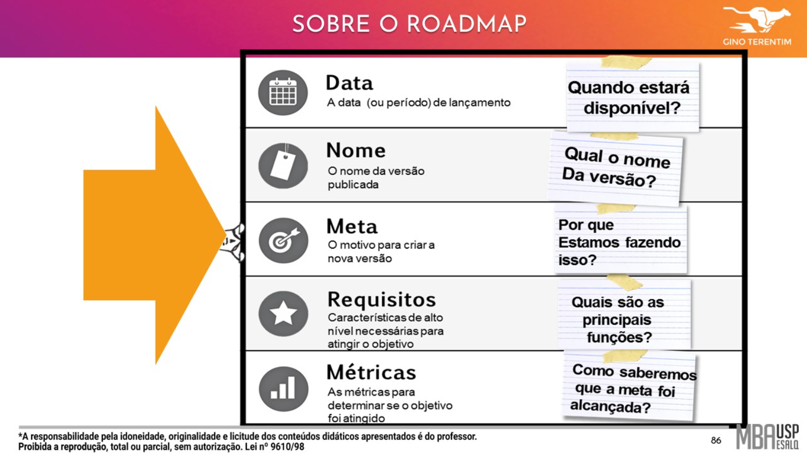
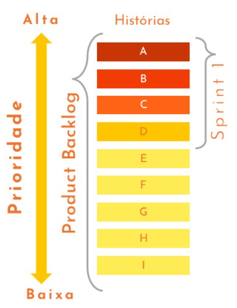

# Métodos Ágeis II

## :one: Product Market Fit

Como falado na aula anterior, os problemas possuem três estágios: **Problem Solution Fit**, que é a etapa onde se procurar encontrara a solução para o problema, o **Product Market Fit** que é quando procura-se entender se a solução irá necessitar de alguma mudança de comportamento das pessoas e se o mercado tem interesse no produto e por último **Scale** que é a etapa de entrega do produto, seja para todos ou por uma parcela exclusiva das pessoas.

E apesar de também ter sido dito que não necessariamente todos os problemas vão passar pelos três estágios (por exemplo, existem problemas cujas solução já são conhecidas, não havendo necessidade de investigação ou que não vão necessitar de uma mudança de comportamento do mercado), é importante saber qual a impressão dele para o mercado, caso contrário, se você lança-lo sem realizar esse estudo, pode acabar lançando um produto já morto (ou utilizando um termo mais atual, um *flop*).

- O professor mostra como exemplo a continuação do trecho do filme "Fome de Poder", onde os irmãos McDonald's, após encontrarem a solução para o problema de preparar hamburguers em apenas 30 segundos utilizando giz em uma quadra (Problem Solution Fit), pularam a segunda etapa, isto é, a pesquisa de mercado (Product Market Fit) e indo direto pra etapa de confecção (Scale), entregando o projeto da cozinha na mão de uma empresa. O resultado disso foi que no dia do lançamento foi um desastre, pois a proposta idealizada por eles mudava totalmente a forma como as pessoas naquela época estavam acostumadas a comer sanduíche: dentro de um carro, com uma bandeija e com uma garçonete indo atender eles. As pessoas não entenderam e não compraram a ideia deles de primeira, o que poderia ter sido evitado caso eles tivessem feito um estado do mercado anteriormente.

Frameworks como Scrum e XP são voltado para confecção de novos produtos (até por isso o conjunto de todas as estórias de um produto formam o **Product** Backlog e não o **Solution** Backlog) e não para resolução de problemas. Para a resolução de problemas existem outros métodos também baseados no Ágil como o **Design Sprint**.

"*O ágil vem para transformar simples produtos em produtos que as pessoas queiram.*"

## :two: Difusão da Inovação

Segundo Everett Rogers, a inovação não é uma coisa e sim uma ideia, uma prática ou objeto que é percebido por um indivíduo ou um grupo e que pouco importa se a ideia de fato é nova e sim que ela gere essa percepção nas pessoas.

Você passar pela problem solution fit e fazer algo bom tecnicamente não vai te garantir bons resultados necessariamente. O processo de difusão da inovação passa por uma série de unidades de adoção (ou grupos) até que finalmente seja adotado pela maioria.

- **Inovadores:** São aquelas pessoas que possuem boas ideias mas não tem força pra as difundirem sozinhos;
- **Primeiros adeptos:** Esses são os chamados visionários, pois olham para o produto pensando no futuro. Para atingir esses grupos é interessante realizar um estudo de redes sociais, para encontrar pessoas que influenciam os nichos/perfis que desejamos atingir;
- **Maioria Inicial:** Nesse momento é quando há a mudança de chave e quando se atinge essa parcela da população, seu produto começa de fato a se difundir no mercado de forma considerável. Eles querem mudar seu comportamento e precisam da prova social gerada pelos primeiros adeptos;
- **Maioria Final:** É aquele ditado "Se mais de 50% dos meus amigos forem verdes, eu serei verde". Nós seres humanos somos seres sociáveis e temos a necessidade de imitação e não queremos ficar para trás, por isso vamos adotar esse produto;
- **Obsoletos:** Parcela que não irá aderir ao produto.

Melhor do que atender mais ou menos um monte de gente, selecione um nicho e arrebente com ele e depois vá para o próximo e vá tomando o mercado aos poucos.

**Diferença entre Protótipo x MVP:** Você quer testar se uma solução funciona (Problem Solution Fit) x Você já tem a solução e quer verificar se ela vai ser aceita pelo mercado (Product Market Fit).

## :three: Planning Onion

O Planning Onion, ou PO é utilizado para representar os diferentes níveis de planejamento que deve-se realizar em projetos de software.

Esse nome se deve a analogia feita com uma cebola (*Onion*, em inglês), onde cada camada da mesma representa uma etapa do projeto e quanto mais interna a camada mais detalhado deve estar o projeto.

Vamos entender cada um desses passos:

- **Visão:** Preferencialmente deve ser elaborada antes do início do projeto e deve abordar os problemas principais que o produto deseja resolver. É uma boa prática que essa visão seja apresentada pelo dono do produto ao time Scrum e que a partir dela serão gerados os insumos necessários para criar e manter o backlog do mesmo.

  - Uma forma de construir a visão de um produto é utilizando a técnica de **Elevator Pitch**:

    

  - Um Pitch é uma apresentação curta e direta sobre um produto ou uma empresa que tem como objetivo despertar a atenção de um investidor, parceiro ou cliente pelo negócio.

- **Roadmap:** A ideia dessa etapa é criar uma representação visual da estratégia relacionada ao projeto. Entre as informações fornecidas por essa etapa podem estar o orçamento do projeto, a data de entrega ou os períodos de lançamentos, os nomes das versões, a meta para cada uma dessas versões, quais os requisitos que devem ser satisfeitos e como medir se as metas foram atingidas ou não.

  

- **Release:** Representa o resultado final de um backlog de estórias priorizadas que geraram algum valor, isto é, uma parte utilizável do produto, sendo possível avaliar se ele está indo para o caminho certo (ta quente/ta frio). As vezes são necessárias várias sprints antes de gerar uma release.

- **Sprint:** Conjunto de estórias que pretende-se entregar ao cliente no final de cada iteração. Essas estórias são priorizadas pelo Gerente de Projeto de acordo com o valor que elas possuem em relação a visão do projeto. Esses itens são compartilhados com a equipe que se responsabiliza por implementá-las.

- **Backlog:** Criado a partir da visão do produto. É uma lista ordenada de tudo aquilo que é necessário para criar o produto (caso esteja fora desta lista, não será feito), como requisitos de negócio, não funcionais, melhorias, correções, testes de arquitetura, etc. Esses itens devem ser constituídos e priorizados pelo Product Owner.

  

  - Devemos ter a noção de que um backlog nunca está totalmente completo, estando em constante evolução e itens sendo adicionados e removidos da lista ao longo do projeto quando as necessidades surgem;
  - Antes de cada sprint o Product Owner faz a repriorização do backlog, uma vez que os objetivos podem se alterar ao longo do tempo;
  - O backlog deve ser constantemente refinado, afim de prover mais detalhes sobre determinado requisito, à medida que esses detalhes estiverem disponíveis;
  - O backlog deve ser **D.E.E.P**: **D**etalhado no nível certo, **E**stimado adequadamente, **E**mergente (ou seja, evolui com o tempo) e **P**riorizado.

  

  - Uma técnica para fazer a priorização de demandas é o **MoSCoW**, isto é, classifica as demandas como *Must have* (devem ser feitas), *Should have* (deveriam ser feitas), *Could have* (poderiam ser feitas) e *Won't have* (não devem ser feitas - pelo menos por enquanto) e os itens entregáveis devem ser implementados nessa ordem, que pode ser revista no planejamento de cada sprint;
  - "*Se tudo é importante, nada é importante*".

## :four: Scrum

"*Não é sobre finanças. Não é estratégia. Não é tecnologia. É o trabalho em equipe que continua sendo a maior vantagem competitiva, tanto porque é tão poderoso quanto raro.*" - Patrick Lencioni

Scrum é um framework e não um método, pois ele não diz o que fazer, quando ou como e sim apresenta princípios que ajudam pessoas, times e organizações a gerar valor por meio de soluções adaptativas para problemas complexos.

O Scrum é propositalmente incompleto, pois ele define apenas as partes necessárias para que funcione, podendo ser incrementado de acordo com as necessidade de cada ambiente (desde que não acabe ferindo um dos seus princípios).

O Scrum é baseado no empirismo e no Lean Thinking. O empirismo afirma que o conhecimento vem da experimentação e da tomada de decisão baseado nos resultado obtidos, enquanto o Lean Thinking procura reduzir o desperdício e concentrar no essencial.

Além disso, ele emprega uma abordagem iterativa e incremental para otimizar a imprevisibilidade e controlar riscos.

Seus grupos devem ser formados por pessoas que possuem as habilidades e conhecimentos necessários para se realizar o trabalho e ou compartilhá-las quando necessário.

### :arrow_right: Pilares do Scrum

O Scrum combina quatro eventos formais dentro de uma sprint que satisfazem os seus pilares:

1. **Transparência:** Todas as informações devem estar disponíveis e acessíveis a todos os membros da equipe, promovendo a confiança e colaboração, e permitindo que todos no projeto tenham compreensão clara do que está acontecendo, podendo tomar posições embasadas e alinhadas com os objetivos do projeto.

2. **Inspeção:** Realizar avaliação contínua do trabalho através de uma abordagem iterativa e incremental para encontrar pontos de melhoria no produto. É importante que a equipe esteja aberta a feedbacks e pronta para realizar ajustes e correções necessárias para melhorar o produto. Isso permite uma análise criteriosa do progresso do projeto, garantindo a qualidade e entrega de valor.

3. **Adaptação:** O ambiente onde os projetos são desenvolvidos são dinâmicos e incertos, sendo a adaptação fundamental para responder as mudanças que ocorrem ao longo do tempo. Os feedbacks e aprendizados obtidos durante a etapa de inspeção permite a equipe realizar ajustes e mudanças tanto no produto quanto no processo de trabalho.

Os três pilares estão interligados e se fortalecem mutuamente. A transparência é necessária para que a inspeção possa ser realizada de forma efetiva e a inspeção alimenta a adaptação com informações relevantes para a tomada de decisão.

### :arrow_right: Os Valores do Scrum

1. **Coragem:** O Time Scrum precisa ter coragem para fazer a coisa certa e trabalhar em problemas difíceis. Como já falado anteriormente, é necessário que seja criado um ambiente que permita o erro e premie o aprendizado.

2. **Foco:** Todos focam no trabalho da Sprint e nos objetivos do Time Scrum, evitando disperdícios e ruídos externos.

3. **Comprometimento:** As pessoas se comprometem pessoalmente em alcançar os objetivos do Time Scrum e suportar uns aos outros.

4. **Respeito:** Os membros do Time Scrum respeitam uns aos outros para serem pessoas capazes e independentes.

5. **Abertura:** O Time Scrum e seus Stakeholders concordam em estarem abertos a todo o trabalho e aos desafios com a execução dos trabalhos.

### :arrow_right: Papéis

Unidade fundamental do Scrum, composto por um Scrum Master, um Product Owner e os Developers, não havendo sub-times ou hierarquias.

Os Scrum Teams são multifuncionais, isto é, todos os membros possuem todas as habilidades necessárias para criar valor a cada Sprint, além de autogerenciáveis, que significa que eles decidem internamente quem faz o quê, quando e como.

Os Scrum Teams devem ser pequenos o suficiente para permanecer ágil e facilitar a comunicação e grande o suficiente para conseguirem concluir um trabalho significativo dentro de uma Sprint. Normalmente são compostos por dez pessoas ou menos.

1. **Product Owner (Foco nas prioridades para o negócio, adição de valor):** Representa os interesses dos clientes, assegura que as entregas adicionem valor e que o backlog esteja sempre priorizado, atualizado e que reflita aquilo que é mais importante para os usuários, clientes e para a empresa.

2. **Scrum Master (Foco nos processos e no desenvolvimento das pessoas):** É o líder de uma equipe autogerenciável e tem o papel de um mentor, que remove impedimentos e desenvolve constantemente as pessoas. Caminha com a equipe num constante processo que busca identificar o que não está funcionando e o que deve ser mudado. Ele é responsável por fazer com que o Scrum seja seguido conforme o Guia Scrum.

3. **Developers (Foco nas entregas, valor adicionado e em uso):** Time auto-organizado, autogerenciável, empoderado e independente. Possuem autoridade para tomar decisões, assumir riscos e responsabilidades. É uma equipe multidisciplinar e com profundos conhecimentos sobre a sua área de atuação

### :arrow_right: Eventos e Artefatos

Uma Sprint é um contêiner que armazena todos os outros eventos do Scrum e deve durar 30 dias ou menos.

Cada evento no Scrum é uma oportunidade formal para inspecionar e adaptar os artefatos do Scrum, fortalecendo os três pilares já apresentados e permitindo previsibilidade.

Esses eventos são usados para criar regularidade e minimizar a necessidade de reuniões além das já programas no Scrum.

O ideal é que todos esses eventos sejam realizados no mesmo horário e local para reduzir complexidade e evitar que algum membro do time não compareça.

Quando o tempo da Sprint é muito longo, a meta dela pode se tornar inválida, e a complexidade e o risco podem aumentar. Sprints mais curtas permitem mais ciclos de aprendizagem e limitam os riscos de custo e esforço. Cada Sprint pode ser considerada um projeto curto.

Na imagem abaixo temos uma representação visual dos eventos e artefatos que compõe uma Sprint no Scrum:

- Uma Sprint se inicia após o fim da anterior;

- Antes do início da Sprint já possuímos o primeiro artefato do Scrum que é o **Product Backlog** que nada mais é do que as estórias que compõe a visão/meta do produto, organizados do mais importante para o menos.

- No dia 1 da Sprint, deve ser realizada a **Sprint Planning**, onde todos os componentes do Scrum Team devem participar e devem em conjunto definir quais estórias serão tratadas no ciclo atual.
  - Tem duração máxima de oito horas para Sprint de trinta dias sendo mais curtos para Sprints menores;
  - É papel do Product Owner garantir que os participantes estejam preparados para discutir os itens mais importantes do Product Backlog;
  - O Scrum Master pode convidar outras pessoas para participarem afim de adicionarem mais informações referentes aos itens abordados;
  - A Sprint Planning aborda os seguintes tópicos:

    1. **Por que esta Sprint é valiosa?** O PO propõe como o produto pode aumentar seu valor na sprint atual. Todo o Scrum Team então colabora para definir uma meta na Sprint que comunica o porque ela é valiosa para os Stakeholders;
    2. **O que pode ser feito nesta Sprint?** Por meio de discussão com o PO, os Developers selecionam itens do Product Backlog para incluir na Sprint que se inicia. O Scrum Team pode refinar esses itens durante essa etapa, isto é, solicitar mais informações, o que aumenta a compreensão e confiança;
    3. **Como o trabalho escolhido será realizado?** Para cada item selecionado do Product Backlog, os Developers são responsáveis por decompô-los em itens menores e definem o esforço necessário para cada um deles e quem será responsável pelos mesmos.

  - No final da Sprint Planning, teremos gerado o segundo artefato do Scrum que é o **Sprint Backlog**, que é composto pela Meta da Sprint, os itens selecionados do Sprint Backlog e o plano de ação para entregá-los. Ela é feita por e para os Developers.

    

- A própria **Sprint** é um evento dentro de sí mesma, onde os Developers incrementam o valor do produto conforme acordado no planejamento. Afim de especionar o progresso da Sprint e adaptar o Sprint Backlog conforme a necessidade, são realizadas as **Daily Scrums**.
  - Esse evento é diário;
  - Possui no máximo 15 minutos;
  - Deve ser realizado sempre no mesmo local e horário para diminuir complexidade;
  - Deve ser realizado apenas pelos Developers, porém, caso o PO ou SM esteja participando ativamente nos itens da Sprint Backlog, eles também participam como Developers (uma mesma pessoa pode ocupar dois chapéus dentro de um Scrum Team, porém, é importante que ele saiba quando deve adotar cada um deles. No caso da Daily, ele deve incorporar o espírito do Developer);
  - Os Developers podem utilizar qualquer estrutura ou técnica, desde que o Dayli Scrum se concentre no progresso em direção a Meta da Sprint e produza um plano de ação para o próximo dia de trabalho. Isso cria foco e melhora o autogerenciamento;
  - Melhora as comunicações, identificam os impedimentos, promovem a rápida tomada de decisões e consequentemente, eliminam a necessidade de outras reuniões;
  - Porém, a Daily Scrum não é o único horário do dia que os Developers se reúnem para ajustar seu plano, havendo ao longo do dia discussões mais detalhadas.

- A **Sprint Review** é o penúltimo evento da Sprint e tem um prazo máximo de 4 horas para uma Sprint de um mês, sendo menor para Sprints mais curtas. O seu objetivo principal é inspecionar o resultado da Sprint e determinar as adaptações futuras. O Scrum Team apresenta os resultados de seu trabalho para os principais stakeholders e o progresso em direção a Meta do Produto é discutida. Como resultado dessa seção, o Product Backlog pode ser ajustado para atender as necessidades mapeadas durante essa etapa.

- Como última etapa da Sprint, temos a **Sprint Retrospective**, realizada apenas pelos Developers onde eles buscam discutir sobre o trabalho deles durante a Sprint, o que deu certo, o que deu errado e como eles fizeram para solucionar (ou não), o que eles podem melhorar, etc. Ela tem uma duração máxima de três horas para Sprints de 30 dias sendo menor para casos mais curtos. Assim como a Sprint Review, alguns pontos discutidos nessa etapa podem ajudar a refiniar o Product Backlog.

- No final da Sprint temos o último artefato do Scrum que é o **Incremento**, que nada mais é do que o produto final da Sprint. Esse resultado final também pode influenciar no Product Backlog de alguma forma.

## :five: XP (eXtreme Programming)

O XP é uma metodologia ágil utilizada para o desenvolvimento de softwares.

As 12 práticas do XP:

- **Práticas de Gestão:**
  - **Cliente no Local:** Um contato central do cliente deve estar sempre acessível para esclarecer requisitos e perguntas diretamente.
  - **Jogo de Planejamento:** Projetos são iterativos (repetidos) e incrementais (construídos gradualmente). Os conteúdos da próxima etapa são planejados antes de cada iteração. Todos os membros do projeto (incluindo o cliente) participam.
  - **Lançamentos Curtos:** Novas entregas devem ser feitas em intervalos curtos. Consequentemente, os clientes recebem as funções necessárias mais rapidamente e podem fornecer feedback sobre o desenvolvimento mais rapidamente.

- **Práticas de Equipe:**
  - **Metáfora:** Apenas algumas metáforas claras devem descrever o sistema em desenvolvimento, de modo que os detalhes do sistema sejam claros para todos os membros do projeto.
  - **Propriedade Coletiva:** Toda a equipe é responsável pelo sistema, não indivíduos. Cada desenvolvedor deve ter acesso a todas as linhas de código para que cada um possa assumir a tarefa de outro desenvolvedor.
  - **Integração Contínua:** Todas as mudanças no sistema são integradas protamente para que não ocorram muitas dependências entre as mudanças.
  - **Padrões de Codificação:** Considerando a responsabilidade comum pelo código, deve haver um padrão comum estabelecido para a escrita do código.
  - **Ritmo Sustentável:** O Xp se baseia na criatividade dos membros individuais do projeto. Essa criatividade não pode ser alcançada se a equipe do projeto trabalhar constantemente em horas extras. Horas extras devem ser evitadas.

- **Práticas de Programação:**
  - **Teste:** Todos os desenvolvimentos devem ser testados.
  - **Design Simples:** O sistema deve ser projetado da forma mais simples possível para que seja mais fácil de entender, modificar e testar.
  - **Refatoração:** Assim que se tornar necessário alterar a estrutura do sistema, isso deve ser implementado.
  - **Programação em Pares:** Sempre há dois desenvolvedores sentados em frente a um computador para aumentar a qualidade e transferir melhor o conhecimento.

Vantagens e desvantagens do uso do XP:

| Vantagens | Desvantagens |
| :-------: | :----------: |
| Grandes projetos são divididos em quantidades gerenciáveis. | XP foca mais no código do que no design. |
| Redução de custos e tempo necessários para a realização do projeto. | XP requer planejamento detalhado desde o início devido a mudanças de custos e escopo. |
| Economia significativa de dinheiro por usar pouca documentação. | XP não mede/planeja a garantia de qualidade do código. |
| Simplicidade, buscando sempre o que pode ser evitado. | Convencer os desenvolvedores a aceitar essa práticas difícil nem sempre é fácil. Requer mais disciplina na equipe e dedicação dos clientes. |
| XP reduz os riscos relacionados à programação, espalhando riscos e diminuindo a dependência de indivíduos-chave. | A gestão de projetos pode ter dificuldades relacionadas às práticas que mudam durante o ciclo de vida. |
| A simplicidade em software traz qualidade e robustez, resultando em software mais rápido com menos defeitos. | A programação em pares praticada pelo XP pode levar a muita duplicação de código e dados. |
| Desenvolvimento orientado a testes e validação do cliente levam a um desenvolvimento bem sucedido. ||

## :six: Kanban

Antes de tudo devemos entender que existe o kanban com k minúsculo, o Kanban com k maiúsculo e o Quadro Kanban. Vamos aprender o que cada um deles significa.

A palavra kanban (com k minúsculo) é de origem japonesa e traduzindo para o português significa algo como "placa de sinalização". Esse nome foi utilizado para nomear o sistema de visualização introduzido por Taiichi Ohno, em 1940, no Sistema Toyota de Produção conhecido como *Just in Time* (ou JIT), onde a produção acontecia de acordo com a demanda, evitando desperdícios e grandes lotes de produtos prontos armazenados sem serem vendidos. O sistema kanban consistia em um quadro onde era possível visualizar o estado atual do processo de fabricação. Ele foi baseado num sistema visual de abastecimento de um supermercado: conforme os produtos vão sendo vendidos (consumidos), os espaços vazios vão sendo reabastecidos.

O Kanban (com k maiúsculo) por sua vez, é um método criado por David Anderson, em 2002, que adapta o kanban que surgiu na Toyota. Ele é um conjunto de princípios e práticas que tem o objetivo de proporcionar uma evolução na forma que sua equipe (ou empresa) entrega valor nos serviços prestados.

"*Tarefas são puxadas por quem irá executá-las e não empurradas para eles.*"

"*Pare de começar e comece a terminar.*"

"*Muita iniciativa e pouca finalização.*"

Como utilizar o Kanban:

1. Iniciamos o Kanban com uma lista ou backlog de itens a serem implementados;
2. Adicionamos as etapas do processo, como por exemplo, "A fazer", "Análise", "Execução", "Conclusão" e "Feito" em cada uma das colunas. Claro que esse exemplo é bem simplório e as etapas devem refletir a realidade de cada projeto e empresa e podem ser refinado com o tempo;
3. Adicionamos filas as etapas intermediárias. Como saberemos se podemos puxar um cartão para a próxima etapa? Ele está em "Análise", mas como vamos saber se ela está no início ou já foi finalizada?
4. Delimitamos a quantidade de itens que cada etapa pode conter, conhecido como WIP Limits (*Work In Progress Limits*). Isso evita a frase "Muito iniciativa e pouca finalização", pois as pessoas vão ser obrigados a finalizar um item para conseguir puxar outro;
5. É possível ainda determinar uma raia apenas com itens urgentes e eles terão prioridade sobre os demais. Caso seja possível puxar um item para a próxima etapa e tenha um classificado como urgente, esse deve ser puxado independentemente do que houver no restante da lista de tarefas pendentes.

Na imagem abaixo temos um exemplo de como é um quadro Kanban, que torna visual os princípios do método Kanban. Existem diversas ferramentas:

Essa representação gráfica permite identificarmos rapidamente em qual etapa o nosso processo está sofrendo um gargalo e propor melhorias.

O Scrum casou muito bem com o Kanban pois ele atende aos seus três pilares: transparência, inspeção e adaptação, sendo o conjunto deles apelidade de **Scrumban**.
