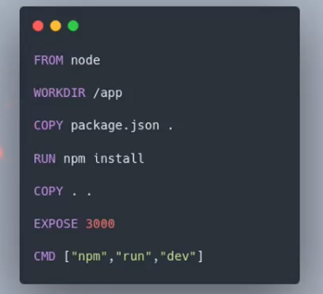

# Containers (Kubernetes) I

## :one: Introdução

Seja o seguinte exemplo, onde subimos uma solução localmente em nossa máquina:

A solução acima é formada por quatro componentes: um banco de dados relacional PostgreSQL, uma aplicação de back-end rodando na porta 8000, uma aplicação de front-end sendo executada na porta 3000 e um proxy-reverso, que realiza o redirecionamento da url `https://meu-dominio.com.br` para a porta correta da aplicação.

O problema é que subir aplicações diretamente no sistema operacional da máquina hospedeira pode trazer uma série de desafios:

- **Compartilhamento de recursos:** Caso o Back-end esteja sendo muito consumido no momomento, ele pode acabar onerando consideravelmente os recursos computacionais da máquina, como processador e memória, impedindo que os demais nós do sistema não funcionem corretamente;

- **Gestão de aplicações:** Pode acontecer que um dos nós, por exemplo, o Back-end da nossa solução tenha algum problema e fique indisponível. Como podemos fazer esse gerenciamento de forma simples? Criar um script para monitorar os nós da aplicação e quando identificar que um deles está fora, reinicializá-los automaticamente?;

- **Migração de ambiente:** Caso eu precise migrar minha solução de um ambiente Windows para um Linux, por exemplo, quais desafios eu vou ter?

- **Implantação do ambiente:** Eu preciso inicializar o banco de dados antes do back-end e este antes do front-end? Ou posso subir esses nós em qualquer ordem? Como podemos determinar uma ordem de inicialização dos componentes do nosso sistema?

É nesse momento que entra o **Docker**, uma plataforma Open Source de virtualização de containers que simplifica o desenvolvimento, implantação e execução de aplicativos, proporcionando ambientes isolados e consistentes para suas operações. Foi escrita em linguagem Go, por Solomon Hykes e lançada em março de 2013, sendo uma tecnología disruptiva no mercado.

- Existem outras alternativas de containerização de aplicações no mercado, sendo o Docker a líder de mercado nesse seguimento.

## :two: Virtual Machine (VM) x Container (Docker)

Uma outra de realizar a virtualização de aplicações e que surgiu muito antes do Docker são as máquinas virtuais. Elas foram muito disruptivas na sua época de lançamento, sendo muito importantes para o nascimento das tecnológias de nuvem, porém, perde em alguns pontos quando comparamos com o Docker.

Benefícios da utilização de containers:

- **Isolamento:** a conteinerização permite a criação de um ambiente consistente e com isolamento de recursos, exatamente como as máquinas virtuais fazem;

- **Portabilidade:** Independência da plataforma no qual estão instaladas e de fácil migração;

- **Eficiência no uso de recursos:** Nesse ponto temos a grande diferença entre máquinas virtuais e ambientes de container e que acaba pesando a favor do Docker que é o overhead reduzido e o tempo rápido de inicialização. Como podemos ver na imagem comparativa acima, os ambientes virtualizados utilizando VMs são compostos pela aplicação, os binários e bibliotecas necessários para que essa aplicação funcione e um sistema operacional convidado (*guest*), apartado do sistema operacional da máquina hospedeira. O container, por sua vez, compartilha o Kernel com o SO da máquina física, sendo muito mais leve e mais rápido de inicializar, já que não é necessário realizar o bot de um novo sistema operacional;

- **Gestão simplificada:** Automação do ciclo de via da aplicação, isto é, caso uma aplicação morra por alguma questão, facilmente conseguimos reinicializá-la utilizando o Docker, seja manualmente (via interface gráfica ou linha de comando) ou de forma automatizada;

- **Desenvolvimento Ágil e DevOps:** permite a reprodução de ambientes de desenvolvimento de forma facilitada, havendo repositórios oficiais online contendo várias aplicações conhecidas do mercado no formato de containers. É facilmente integrável a ferramentas de CI/CD;

- **Facilidade na manutenção:** Simplicidade nas atualizações e realização de rollbacks, sendo possível versionar esses containers.

## :three: Plataforma Docker

O Docker possui uma arquitetura cliente-servidor e possui três grandes componentes:

- **Client:** aplicação cliente no qual o usuário realiza a interação com o Docker e manipula seus containers e imagens. Existe tanto a opção de interação via linha de comando ou através de uma interface gráfica que é o Docker Desktop;

- **Docker Host:** é composto pelo Deamon, que é a API que contém as regras de negócio do Docker, faz o gerenciamento dos containers e imagens e permite que o usuário manipule esses arquivos;

- **Registry:** Plataforma de repositório de imagens. O [Docker Hub](https://hub.docker.com/) é a plataforma oficial do Docker, que permite a criação de repositórios públicos e privados, e contém imagens oficiais de diferentes tecnologias muito conhecidas do mercado. Existem outros registros de container que também podem ser explorados, alguns deles disponíveis na web e outros privados, como por exemplo, servidores coorporativos.

  - Provavelmente já existe uma imagem para o que você precisa.

## :four: Fluxo para Criação de um Container

Tudo começa a partir de um Dockerfile, um script que contém uma série de comandos, em forma de camadas, para criação de uma imagem Docker utilizando o formato `INSTRUÇÃO argumento`, como vemos na imagem abaixo:

Existem três comandos iniciais que podem ser considerados os principais para o funcionamento de uma aplicação em containers:

1. O primeiro deles é o `docker pull`. Esse comando permite que realizemos o download de imagens prontas depositadas em um registry remoto (por padrão, o Docker realiza a busca no Docker Hub). Assim que essa imagem é baixada, ela é armazenada no registro local da máquina e pronta para uso.

    

2. Porém, nem sempre vamos querer utilizar imagens prontas e sim utilizar nossas. Nesse caso escrevemos um **Dockerfile** (e por boa prática indicamos uma imagem base pré-existente) e executamos o comando `docker build`. Nesse momento é criada uma imagem baseada nesse arquivo e armazenada no registro local da máquina.

    

3. Por fim, já com a imagem em mãos, seja ela criada através de um Dockerfile ou importada de um registro remoto, utilizamos o comando `docker run` para realizar a criação do container, fazendo com que nossa aplicação comece a funcionar.

    
